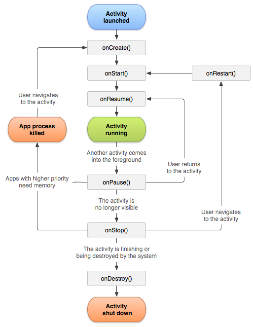

### Desenvolvimento de Jogos para Plataformas Móveis
### Programação de Dispositivos Móveis
Lourenço Gomes
lgomes@ipca.pt
tel:933823779

---

## Material
- Comutador Windows/Mac/Linux
- Android Studio
- Git
- Slack

---

# Avaliação
### Avaliação continua
- Aquisição de competências verificadas em contexto de aula, atravès de desenvolvimento pequenos projectos, até término das aulas em dezembro. 

### Trabalho de grupo
- Especificação - meados de novembro
- Defesa - Na ultima aula de janeiro
---

# Avaliação

### Exame
- Exame teórico sem consulta e sem recurso a computador
- Defesa do trabalho de grupo ou outro trabalho a combinar
(caso não seja possivel defender o trabalho de grupo)
### Nota Final
- Avaliação continua: NF = AC*50% + TG*50%
- Exame: NF = EXAME*50% + TG*50%


---
# Aquisição de competencias

```
Composable |  Funcional  | Lists | Navigation | REST  | Android  | Gameloop	| Firebase |    Clean 
     UI    | Programming |       |            |  API  |  Room    |       	|          | Architecture

     ✅           ✅          ✅        ✅         ✅       ✅          ✅         ✅           ✅  
```

---

# Conteúdo
- Linguagem de programação Kotlin, conceitos fundamentais e comparação com outras linguagens de programação.
- Conceitos fundamentais sobre dispositivos de computação móvel SDKs e Frameworks;
- Desenvolvimento de Aplicações Móveis
- Compreender o LifeCycle das aplicações e componente do Android
- Desenvolvimento de motor de jogo(EDJD)

---

## Conteúdo
- Comunicação Web seguindo a arquitecta de API REST.(LESI)
- Armazenamento de informação estruturada e não estruturada.
- Compreender o padrão de arquitetura de software Model-view-view-Model(MVVM);
- Compreender Threads e sincronização.
- Notificações push.
- Desenvolvimento de interfaces em Android Compose
- Conceitos de Programação orientada a objectos e programação funcional

---

# Kotlin

---

# Hello World
```kotlin
fun main(args: Array<String>) {
    println("Olá Mundo!")
}
```

```kotlin
fun main(args: Array<String>) {
    println("Olá Mundo!")
    println(42)
}
```
---

# Variable declarion
```kotlin
var result : Int
//Declaração explicita
var result = 0
//Declaração implicita
val a: Int = 1  // immediate assignment
val b = 2       // `Int` type is inferred
val c: Int      // Type required when no initializer is provided
c = 3           // deferred assignment
```
---

# VAR or VAL
var  - declaração de variável
val  - declaração de uma constante

---

# Null types
```kotlin
var a : Int? = null
a = 5
println(a)
// 5
a = null
var b = 6
b = null 
// compilation error
```
---

# Null safety
```kotlin
val b: String? = "Kotlin"

if (b != null && b.length > 0) {
    print("String of length ${b.length}")
} else {
    print("Empty string")
}

val a = "Kotlin"
val b: String? = null
println(b?.length)
println(a?.length) 
// Unnecessary safe call
```
---
# Null safety
```kotlin
var a : Int? = null
a = 5
a?.let { num ->
    println(num + 5)
    // 10
}

print( a!! + 5)
//10
var a : Int? = null
a = 5
…

a = null
print( a!! + 5)
// Will be raised an exception
```

---
# Elvis operator

When you have a nullable reference b, you can say "if b is not null, use it, otherwise use some non-null value”:

```kotlin
val l: Int = if (b != null) b.length else -1
```

Along with the complete if -expression, this can be expressed with the Elvis operator, written ?:

```kotlin
val l = b?.length ?: -1
```

---
# The !! operator

The third option is for NPE-lovers: the not-null assertion operator (!!) converts any value to a non-null type and throws an exception if the value is null. You can write b!!, and this will return a non-null value of b (for example, a String in our example) or throw an NPE if b is null:

```kotlin
val l = b!!.length
```

Thus, if you want an NPE, you can have it, but you have to ask for it explicitly, and it does not appear out of the blue.

---
# Safe casts

Regular casts may result into a ClassCastException if the object is not of the target type. Another option is to use safe casts that return null if the attempt was not successful:

```kotlin
val aInt: Int? = a as? Int
```

---
# Operadores
---
# Assignment Operator
```kotlin
val l = 1L + 3 // Long + Int => Long
val b = 10
var a = 5
a = b
// a is now equal to 10

if (a = b) {
// This is not valid, because x = y does not return a value.
}

a += 1
a -= 1
a *= 10
a /= 10

a ^= 2
```
---
# Arithmetic Operators
```kotlin
1 + 2       // equals 3
5 - 3       // equals 2
2 * 3       // equals 6
10.0 / 2.5  // equals 4.0

"hello, " + "world"  // equals "hello, world"
```

---
# Remainder Operator
```kotlin
9 % 4    // equals 1

//9 = (4 x 2) + 1

-9 % 4   // equals -1

//-9 = (4 x -2) + -1
```

---

# Unary Operator
```kotlin
val three = 3
val minusThree = -three       // minusThree equals -3
val plusThree = -minusThree   // plusThree equals 3, or "minus minus three"

val minusSix = -6

val alsoMinusSix = +minusSix  // alsoMinusSix equals -6

//Compound Assignment Operators
var a = 1
a += 2
// a is now equal to 3
```

---

# Comparison Operators

```kotlin
1 == 1   // true because 1 is equal to 1
2 != 1   // true because 2 is not equal to 1
2 > 1    // true because 2 is greater than 1
1 < 2    // true because 1 is less than 2
1 >= 1   // true because 1 is greater than or equal to 1
2 <= 1   // false because 2 is not less than or equal to 1

val name = "world"
if (name == "world") {
    print("hello, world")
} else {
    print("I'm sorry ${name}, but I don't recognize you")
}
```

---

# Ternary Conditional Operator
```kotlin
if (question) {
    answer1
} else {
    answer2
}

val contentHeight = 40
val hasHeader = true
val rowHeight = contentHeight + (if (hasHeader)  50 else 20)
// rowHeight is equal to 90
```

---

# Range Operators
```kotlin
for (index in 1 .. 5) {
    print("$index times 5 is ${index * 5}")
}
// 1 times 5 is 5
// 2 times 5 is 10
// 3 times 5 is 15
// 4 times 5 is 20
// 5 times 5 is 25
```
Range instantiation and range checks:
```kotlin
a..b, x in a..b, x !in a..b
```

---

# Combining Logical Operators
```kotlin
if ((enteredDoorCode && passedRetinaScan) || hasDoorKey || knowsOverridePassword){
    print("Welcome!")
} else {
    print("ACCESS DENIED")
}
```

---
# Control Flow
---

# For-In Loops
```kotlin
for (index in 1..5) {
    println("${index} times 5 is ${index * 5}")
}
// 1 times 5 is 5
// 2 times 5 is 10
// 3 times 5 is 15
// 4 times 5 is 20
// 5 times 5 is 25

val base = 3
val power = 10
var answer = 1
for (i in 1..power) {
    answer *= base
}
println("${base} to the power of ${power} is ${answer}")
```
---
# For-In Loops
```kotlin
var names = arrayListOf<String>("Anna", "Alex", "Brian", "Jack")
for (name in names) {
    println("Hello, ${name}!")
}

// Hello, Anna!
// Hello, Alex!
// Hello, Brian!
// Hello, Jack!
```
---
# While Loops
```kotlin
while (condition) {
    statements
}
```
---
# While Loops
```kotlin
val finalSquare = 25
var board = intArrayOf(finalSquare +1)

var square = 0
var diceRoll = 0
while (square < finalSquare) {
    // roll the dice
    diceRoll += 1
    if (diceRoll == 7){ diceRoll = 1 }
    // move by the rolled amount
    square += diceRoll
    if (square < board.count) {
        // if we're still on the board, move up or down for a snake or a ladder
        square += board[square]
    }
}
println("Game over!")
```
---
# do-while
```kotlin
do {
    statements
} while (condition)
```
---
# when (switch)
```kotlin
when (some_value_to_consider) {
    value 1 -> respond to value 1
    value 2,
    value 3 -> respond to value 2 or 3
    else -> otherwise, do something else
}

val someCharacter: Char = 'z'
when (someCharacter) {
    'a' -> println("The first letter of the alphabet")
    'z' -> println("The last letter of the alphabet")
    else -> print("Some other character")
}
```
---
# When
```kotlin
val someCharacter: Char = 'a'
when (someCharacter) {
    'a',
    'A' -> println("letter of the alphabet")
    else -> println("not a letter")
}

when (x) {
    0, 1 -> print("x == 0 or x == 1")
    else -> print("otherwise")
}
```

---

# when
```kotlin
when (x) {
    in 1..10 -> print("x is in the range")
    in validNumbers -> print("x is valid")
    !in 10..20 -> print("x is outside the range")
    else -> print("none of the above")
}
```
---

# when
```kotlin
fun hasPrefix(x: Any) = when(x) {
    is String -> x.startsWith("prefix")
    else -> false
}

when {
    x.isOdd() -> print("x is odd")
    x.isEven() -> print("y is even")
    else -> print("x+y is odd")
}
```

---

# continue
```kotlin
var puzzleInput = "great minds think alike"
var puzzleOutput = ""
val charactersToRemove = arrayListOf<Char>('a', 'e', 'i', 'o', 'u', ' ')
for (character in puzzleInput.toCharArray()) {
    if (charactersToRemove.contains(character)) {
        continue
    } else {
        puzzleOutput += character
    }
}
println(puzzleOutput)

// Prints "grtmndsthnklk"
```
---

# break
```kotlin
var puzzleInput = "great minds think alike"
var puzzleOutput = ""
val charactersToRemove = arrayListOf<Char>('a', 'e', 'i', 'o', 'u', ' ')
for (character in puzzleInput.toCharArray()) {
    if (charactersToRemove.contains(character)) {
        break
    } else {
        puzzleOutput += character
    }
}
println(puzzleOutput)

// Prints "gr"
```

---
# Collection Types
Arrays, Sets, Maps

---

# Arrays
```kotlin
var someInts = arrayListOf<Int>()
println("someInts is of type [Int] with ${someInts.size} items.")
// Prints "someInts is of type [Int] with 0 items.

someInts.add(3)
// someInts now contains 1 value of type Int
// someInts = arrayListOf<Int>()
// someInts is now an empty array, but is still of type [Int]

var threeDoubles = DoubleArray(3)
// threeDoubles is of type [Double], and equals [0.0, 0.0, 0.0]

var anotherThreeDoubles = DoubleArray(3) { 2.5 }
// anotherThreeDoubles is of type [Double], and equals [2.5, 2.5, 2.5]

var sixDoubles = threeDoubles + anotherThreeDoubles
// sixDoubles is inferred as [Double], and equals [0.0, 0.0, 0.0, 2.5, 2.5, 2.5]

for ( element in sixDoubles) {
    println(element)
}
```

---

# Arrays
```kotlin
var shoppingList  = arrayListOf<String>("Eggs", "Milk")
// shoppingList has been initialized with two initial items

print("The shopping list contains ${shoppingList.size} items.")
// Prints "The shopping list contains 2 items."

if (shoppingList.isEmpty()) {
    print("The shopping list is empty.")
} else {
    print("The shopping list is not empty.")
}
// Prints "The shopping list is not empty."

shoppingList.add("Flour")
// shoppingList now contains 3 items, and someone is making pancakes
```

---

# Arrays
```kotlin
var shoppingList  = arrayListOf<String>("Eggs", "Milk")
// shoppingList has been initialized with two initial items

println("The shopping list contains ${shoppingList.size} items.")
// Prints "The shopping list contains 2 items."

if (shoppingList.isEmpty()) {
    println("The shopping list is empty.")
} else {
    println("The shopping list is not empty.")
}
// Prints "The shopping list is not empty."

shoppingList.add("Flour")
// shoppingList now contains 3 items, and someone is making pancakes

shoppingList[0] = "Six eggs"
// the first item in the list is now equal to "Six eggs" rather than "Eggs"

shoppingList.add(0, "Maple Syrup")
shoppingList.add(0, "Honey")

shoppingList[1] = "Apples"
// shoppingList now contains 7 items
// "Maple Syrup" is now the first item in the list

for ( product in shoppingList) {
    println(product)
}
```

---

# Sets
```kotlin
var shoppingList  = setOf<String>("Eggs", "Milk")
// shoppingList has been initialized with two initial items

println("The shopping list contains ${shoppingList.size} items.")
// Prints "The shopping list contains 2 items."

if (shoppingList.isEmpty()) {
    println("The shopping list is empty.")
} else {
    println("The shopping list is not empty.")
}
// Prints "The shopping list is not empty."

shoppingList = shoppingList.plus("Flour")
// shoppingList now contains 3 items, and someone is making pancakes

shoppingList = shoppingList.plus("Apples")
shoppingList = shoppingList.plus( "Maple Syrup")
shoppingList = shoppingList.plus( "Honey")

shoppingList = shoppingList.plus("Apples")
// shoppingList now contains 7 items
// "Maple Syrup" is now the first item in the list

for ( product in shoppingList) {
    println(product)
}
```

---

# Set Operations
```kotlin
val oddDigits  = setOf(1, 3, 5, 7, 9)
val evenDigits  = setOf(0, 2, 4, 6, 8)
val singleDigitPrimeNumbers = setOf(2, 3, 5, 7)

var result = oddDigits.union(evenDigits).sorted()
// [0, 1, 2, 3, 4, 5, 6, 7, 8, 9]
for (n in result) print("$n ,")

result = oddDigits.intersect(singleDigitPrimeNumbers).sorted()
// []
println("intersect")
for (n in result) print("$n ,")
```

---

# Maps
```kotlin
val numbersMap = mapOf("one" to 1, "two" to 2, "three" to 3)
println(numbersMap.get("one"))
println(numbersMap["one"])
println(numbersMap.getOrDefault("four", 10))
println(numbersMap["five"])       // null
//numbersMap.getValue("six")      // exception!

val translationMapPT = mapOf(
    "hello" to "olá", 
    "Good Morning" to "Bom dia", 
    "Good bye" to "Adeus")
val translationMapES = mapOf(
    "hello" to "ola", 
    "Good Morning" to "Buenos Dias", 
    "Good bye" to "Asta lá vista")

println(translationMapPT["Good bye"])
println(translationMapES["Good bye"])
```

---

# Maps
```kotlin
val numbersMap = mapOf(
    "one" to 1, 
    "two" to 2, 
    "three" to 3)
println(numbersMap.keys)
println(numbersMap.values)
```

---

# Maps
```kotlin
val numbersMap = mapOf("one" to 1, "two" to 2, "three" to 3)
println(numbersMap + Pair("four", 4))
println(numbersMap + Pair("one", 10))
println(numbersMap + mapOf("five" to 5, "one" to 11))

val numbersMap = mapOf("one" to 1, "two" to 2, "three" to 3)
println(numbersMap - "one")
println(numbersMap - listOf("two", "four"))
```

---

# Maps
```kotlin
val numbersMap = mutableMapOf("one" to 1, "two" to 2)
numbersMap.put("three", 3)
println(numbersMap)
```

---
# Functions

---

# Functions
```kotlin
fun greet(person: String) : String {
val greeting = "Hello, " + person + "!"
    return greeting
}

println(greet( "Anna"))
// Prints "Hello, Anna!"
println(greet( "Brian"))
// Prints "Hello, Brian!"
```

---

# Function
Argument, Labels, and Parameter Names
```kotlin
fun someFunction(firstParameterName: Int, secondParameterName: Int) {
    // In the function body, firstParameterName and secondParameterName
    // refer to the argument values for the first and second parameters.
}
someFunction( 1,  2)
```

---

# Functions
Default Parameter Values
```kotlin
println(greet( ))
// Prints "Hello, John!"
println(greet( "Brian"))
// Prints "Hello, Brian!"

fun greet(person : String = "John") : String {
    val greeting = "Hello, " + person + "!"
    return greeting
}
```

---

# Function

```kotlin
var greet : (String)->String = { person ->
    val greeting = "Hello, " + person + "!"
    greeting
}

fun greet(person : String = "John") : String {
    val greeting = "Hello, " + person + "!"
    return greeting
}
```

---

# Functions multiple parts
```kotlin
fun main(args: Array<String>) {
    greetAllv2(arrayListOf<String>("António", "Joaquim"))
    greetAll("Ana", "Joana")
}

fun greetAll(vararg strings: String) {
    for ( string in strings){
        println("Hello $string!")
    }
}

fun greetAllv2( strings: ArrayList<String>) {
    for ( string in strings){
        println("Hello $string!")
    }
}
```

---

# Programação Funcional

- Funções são **valores** — podem ser guardadas, passadas e devolvidas
- **Funções puras** — mesmo input, mesmo output, sem efeitos secundários
- **Funções de ordem superior** — recebem ou devolvem outras funções
- **Imutabilidade** — preferir `val` e novos valores em vez de alterar estado

---

# Calculator — o exemplo

Aplicação de calculadora em **Jetpack Compose**:

- `CalculatorBrain` — lógica das operações
- `CalculatorView` — interface e estado do ecrã
- `CalculatorButton` — botão reutilizável que recebe uma função de callback

```kotlin
enum class Operation(op: String) {
    ADD("+"), SUBTRACT("-"), MULTIPLY("×"), DIVIDE("÷"),
    EQUAL("="), SQRT("√"), PERCENTAGE("%"),
    CLEAR("AC"), CLEAR_ENTRY("C")
}
```

---

# CalculatorBrain — abordagem imperativa

```kotlin
fun doOperation(newOperand: Double, newOperation: Operation) {
    var result = newOperand
    when (operation) {
        Operation.ADD      -> result = operand + newOperand
        Operation.SUBTRACT -> result = operand - newOperand
        Operation.MULTIPLY -> result = operand * newOperand
        Operation.DIVIDE   -> result = operand / newOperand
        else -> {}
    }
    operation = newOperation
    operand = result
}
```

Funciona, mas cada operação está **duplicada** em `when` — difícil de testar e estender.

---

# Funções puras

Uma função pura depende apenas dos argumentos e **não altera estado externo**:

```kotlin
fun add(a: Double, b: Double): Double = a + b
fun subtract(a: Double, b: Double): Double = a - b
fun multiply(a: Double, b: Double): Double = a * b
fun divide(a: Double, b: Double): Double = a / b
fun sqrt(a: Double): Double = kotlin.math.sqrt(a)
fun percentage(a: Double): Double = a / 100

println(add(2.0, 3.0))        // sempre 5.0
println(sqrt(16.0))           // sempre 4.0
```

Fáceis de testar: `assert(add(2.0, 3.0) == 5.0)`.

---

# Operações como funções

Em vez de `when`, guardamos operações num **mapa de funções**:

```kotlin
typealias BinaryOp = (Double, Double) -> Double
typealias UnaryOp = (Double) -> Double

val binaryOperations = mapOf(
    Operation.ADD      to { a, b -> a + b },
    Operation.SUBTRACT to { a, b -> a - b },
    Operation.MULTIPLY to { a, b -> a * b },
    Operation.DIVIDE   to { a, b -> a / b },
)

val unaryOperations = mapOf(
    Operation.SQRT       to { kotlin.math.sqrt(it) },
    Operation.PERCENTAGE to { it / 100 },
)

fun applyBinary(a: Double, b: Double, op: Operation): Double =
    binaryOperations[op]?.invoke(a, b) ?: b
```

Adicionar `^` (potência) = uma linha no mapa.

---

# CalculatorBrain — abordagem funcional

```kotlin
fun doOperation(newOperand: Double, newOperation: Operation) {
    val result = operation?.let { op ->
        applyBinary(operand, newOperand, op)
    } ?: newOperand

    operation = newOperation
    operand = result
}

fun unaryOperation(newOperand: Double, newOperation: Operation) {
  operand = unaryOperations[newOperation]?.invoke(newOperand)
      ?: binaryOperations[operation]?.invoke(operand, newOperand)
      ?: newOperand
}
```

A lógica de cálculo fica **separada** da gestão de estado.

---

# Enumerations
```kotlin
enum class Direction {
    NORTH, SOUTH, WEST, EAST
}
```

```kotlin
enum class Color(val rgb: Int) {
    RED(0xFF0000),
    GREEN(0x00FF00),
    BLUE(0x0000FF)
}
```

---
# Enumerations

```kotlin
fun main(args: Array<String>) {

    val dir :Direction = Direction.NORTH

    when(dir) {
        Direction.NORTH -> {
            print("Where are we!")
        }
        Direction.SOUTH -> {
            print("Mauritania!")
        }
        Direction.WEST -> {
            print("Spanish!")
        }
        Direction.EAST -> {
            print("Sea!")
        }
    }
}
```
---
# Classes and Data Classes

---

# Classes
```kotlin
class SomeClass {
// class definition goes here
}
```

---
# Object Oriented Programming

#### Car 🚗
- Propriedades
    - Velocity
    - Number of wheels
    - Color
    - Cabin Temperature

- Funcionalidades ou Métodos
    - Accelerate
    - Brake
    - Turn On

---

# Object Oriented Programming
```kotlin
class Car {

    // propreties
    var velocity : Float = 0f
    var wheelsNumber : Int = 0
    var color : Color = Color.BLUE
    var cabinTemperature : Float = 0f
    var isMotorRunning : Boolean = false

    constructor ( wheels : Int, color : Color )  {
        wheelsNumber = wheels
        this.color = color
    }

    // functionality or metods
    fun accelerate  () { velocity += 5 }
    fun brake       () { velocity -= 10 }
    fun turnOn      () { isMotorRunning = true }
    fun turnOff     () { isMotorRunning = false }
}

```
---

# Class/object
```kotlin
var myCar : Car = Car(4, Color.RED)
var mySecondCar : Car = Car(4,  Color.GREEN)

myCar.accelerate()
myCar.accelerate()
println("My car is running at ${myCar.velocity} Km/h")

mySecondCar.accelerate()
println("My second car is running at ${mySecondCar.velocity} Km/h")
```

---

# inheritance
```kotlin
            Vehicle
               |
Car --- Plane --- Boat --- Moto
 🚗       🛩        |        🏍
                _________
               |         |
            Rowing      Motor
            Boat        Boat
             🚣           🚤
```

---
# inheritance
```kotlin

abstract class Vehicle {

    // properties
    var velocity : Float = 0f
    var model : String = ""

    constructor(model:String){
        this.model = model
        println("New vehicle was created with name $model")
    }

    // functionality or methods
    abstract fun accelerate ()
    abstract fun brake ()

    open fun showState(){
        println("The $model is running at $velocity Km/h")
    }
}
```

---
# inheritance
```kotlin
class Boat : Vehicle {

    constructor(model: String) : super(model)

    override fun accelerate() {
        velocity += 2
    }

    override fun brake() {
        velocity -= 1
    }

    override fun showState() {
        println("The Boat $model is running at $velocity Miles/h")
    }
}
```

---
# inheritance
```kotlin

class Car : Vehicle {

    // properties
    var wheelsNumber : Int = 0
    var cabinTemperature : Float = 0f

    constructor ( wheels : Int, model : String ) : super(model) {
        wheelsNumber = wheels
    }

    // functionality or methods
    override fun accelerate () {
        velocity += 5
    }

    override fun brake() {
        velocity -= 10
    }

}
```

---
# Access modifiers

***private*** means visible inside this class only (including all its members).
***protected*** is the same as private but is also visible in subclasses.
***internal*** means that any client inside this module who sees the declaring class sees its internal members.
***public*** means that any client who sees the declaring class sees its public members.

---

# Access modifiers
```kotlin
abstract class Vehicle {

    // properties
    protected var velocity : Float = 0f
    private var model : String = ""

    constructor(model:String){
        this.model = model
        hello()
    }

    // functionality or methods
    abstract fun accelerate ()
    abstract fun brake ()

    open fun showState(){
        println("The $model is running at $velocity Km/h")
    }

    private fun hello(){
        println("New vehicle was created with name $model")
    }
}
```

---
# abstract
You can use abstract to declare a class if some method is abstract or it inherit from an abstract class
An abstract class cannot be instantiated (you cannot create objects of an abstract class). However, you can inherit subclasses from can them.

---
# override, open
You can over a function if its declared as abstract or open in the inherited class

---

# Encapsulation
```kotlin
private var _cabinTemperature : Float = 0.0f

var cabinTemperature : Float

get() {
    println("Someone is looking for the temperature in the cabin")
    return _cabinTemperature
}

set(value) {
    _cabinTemperature = value
    if (_cabinTemperature > 30) {
        _cabinTemperature = 30f
    }else if (_cabinTemperature < 15){
        _cabinTemperature = 15f
    }
}
```

---

# Initialization
```kotlin
var mySecondCar : Car = Car(4,  "Citroen")
vehicles.add(mySecondCar)
mySecondCar.cabinTemperature = 100f
println("Cabin temperature = ${mySecondCar.cabinTemperature}")
```

---

# Initialization
```kotlin
var vehicles = arrayListOf<Vehicle>()

vehicles.add(Car(4, "BMW"))
vehicles.add(Boat("Lamborghini"))
vehicles.add(Moto(2,"Kawasaki"))

for ( vehicle in vehicles){
    vehicle.accelerate()
}

for (vehicle in vehicles){
    vehicle.showState()
}
```

---

# Interface
It's like a class with signature method only
```kotlin
interface Wheels {
    fun checkNumberOfWheels ()
}
```

---

# Interface
```kotlin
class Moto : Vehicle, Wheels {

    var wheelsNumber : Int = 0

    constructor(wheelsNumber : Int, model: String) : super(model) {
        this.wheelsNumber = wheelsNumber
    }

    override fun accelerate () { velocity += 8 }
    override fun brake      () { velocity -= 1 }
    override fun checkNumberOfWheels() {
        println("This moto has $wheelsNumber wheels.")
    }
}
```

---
# Interface

```kotlin
for (vehicle in vehicles){
    vehicle.showState()
    if (vehicle is Wheels) {
        vehicle.checkNumberOfWheels()
    }
}
```

---

# Data Class
```kotlin
data class Person(val name: String, var age: Int)
```

---

# Object

```kotlin
object Test {
    private var a: Int = 0
    var b: Int = 1
    fun makeMe12(): Int {
        a = 12
        return a
    }
}

fun main(args: Array<String>) {
    val result: Int
    result = Test.makeMe12()
    println("b = ${Test.b}")
    println("result = $result")
}
```

---

# Companion object
```kotlin
class Car : Vehicle, Wheels {

// ….

    companion object{
        val FUEL_PRICE = 1.42f
        fun pricePerKm(kilometer : Float) : Float{
            return kilometer * FUEL_PRICE
        }
    }

}
println("50K costs ${Car.pricePerKm(50.0f)}€")
```

---

# extensions
```kotlin
fun Date.longDateString() : String  {
    val format = SimpleDateFormat("EEEE, dd MMMM yyyy - hh:mm:ss", Locale.getDefault())
    return format.format(this)
}

fun main(args: Array<String>) {
    val date = Date()
    println(date.longDateString())
}
```

---
# Scope Functions

---

# let
```kotlin
Person("Alice", 20, "Amsterdam").let {
    println(it)
    it.moveTo("London")
    it.incrementAge()
    println(it)
}
```

---

# let
```kotlin
    val str: String? = "Hello"
    //processNonNullString(str)       // compilation error: str can be null
    str?.let {
        println("let() called on $it")
        processNonNullString(it)      // OK: 'it' is not null inside '?.let { }'
        it.length
    }
```

---

# this or it
```kotlin
fun main() {
    val str = "Hello"
    // this
    str.run {   
    println("The receiver string length: $length")
    //println("The receiver string length: ${this.length}") // does the same
}

    // it
    str.let {
        println("The receiver string's length is ${it.length}")
    }
}
```

---

# With
```kotlin
val numbers = mutableListOf("one", "two", "three")
val firstAndLast = with(numbers) {
    "The first element is ${first()}," +
    " the last element is ${last()}"
}
println(firstAndLast)
```

---

# apply
```kotlin
val adam = Person("Adam").apply {
    age = 32
    city = "London"
}
println(adam)
```

---

# let and run
```kotlin
var str : String? =  null

str?.let {
    println("let() called on $it")
    processNonNullString(it)
    it.length
}?: run {
        str = "hello"
}
```

---

# Delegation
```kotlin
class Example {
    var p: String by Delegate()
}
import kotlin.reflect.KProperty

class Delegate {
    operator fun getValue(thisRef: Any?, property: KProperty<*>): String {
        return "$thisRef, thank you for delegating '${property.name}' to me!"
    }
    
    operator fun setValue(thisRef: Any?, property: KProperty<*>, value: String) {
        println("$value has been assigned to '${property.name}' in $thisRef.")
    }
}
```

---
# Android Introduction
Application Fundamentals

---
# Goal
Understand applications and their components
Concepts:
- activity,
- service,
- broadcast receiver,
- content provider,
- intent,
- Android Manifest

---
# Android OS Structure


---
# **[Android App Life Cycle ](https://developer.android.com/guide/components/activities/activity-lifecycle)** 



---
# Applications
- Written in Java (it’s possible to write native code – will not - cover that here)
- Good separation (and corresponding security) from other - applications:
-- Each application runs in its own process
-- Each process has its own separate VM
-- Each application is assigned a unique Linux user ID – by default - files of that application are only visible to that application - (can be explicitly exported)

---
# Application Components
- Activities – visual user interface focused on a single thing a user can do
- Services – no visual interface – they run in the background
- Broadcast Receivers – receive and react to broadcast announcements
- Content Providers – allow data exchange between applications

---
# Activities
- Basic component of most applications
- Most applications have several activities that start each other as needed
- Each is implemented as a subclass of the base Activity class

---
# Activities – The View
- Each activity has a default window to draw in (although it may prompt for dialogs or notifications)
- The content of the window is a view or a group of views (derived from View or ViewGroup)
- Example of views: buttons, text fields, scroll bars, menu items, check boxes, etc.
- View(Group) made visible via Activity.setContentView() method.

---

# Services
Does not have a visual interface
Runs in the background indefinitely
Examples
Network Downloads
Playing Music
TCP/UDP Server
You can bind to a an existing service and control its operation

---

# Broadcast Receivers
Receive and react to broadcast announcements
Extend the class BroadcastReceiver
Examples of broadcasts:
Low battery, power connected, shutdown, timezone changed, etc.
Other applications can initiate broadcasts

---
# Content Providers
Makes some of the application data available to other applications
It’s the only way to transfer data between applications in Android (no shared files, shared memory, pipes, etc.)
Extends the class ContentProvider;
Other applications use a ContentResolver object to access the data provided via a ContentProvider

---
# Android Manifest
Its main purpose in life is to declare the components to the system
```xml
<?xml version="1.0" encoding="utf-8"?>
    <manifest . . . >
        <application . . . >
           <activity android:name="com.example.project.FreneticActivity"
                       android:icon="@drawable/small_pic.png"
                       android:label="@string/freneticLabel" 
                       . . .  >
             </activity>
             . . .    
     </application>
</manifest>

```
---
# Hello World Android

Três formas de mostrar **"Hello World!"** no ecrã de uma Activity:

1. **Só Kotlin** — criar `View`s em código (`TextView`, `LinearLayout`)
2. **XML** — definir o layout num ficheiro `.xml` e inflar com `setContentView`
3. **Compose** — UI declarativa com funções `@Composable`

Em todos os casos, a Activity é declarada no **AndroidManifest.xml**.

---

# Hello World — só Kotlin (Views)

A UI é construída **programaticamente** — sem ficheiros XML:

```kotlin
class MainActivity : AppCompatActivity() {

    override fun onCreate(savedInstanceState: Bundle?) {
        super.onCreate(savedInstanceState)

        val textView = TextView(this).apply {
            text = "Hello World!"
            textSize = 24f
            gravity = Gravity.CENTER
        }

        val layout = LinearLayout(this).apply {
            orientation = LinearLayout.VERTICAL
            gravity = Gravity.CENTER
            layoutParams = ViewGroup.LayoutParams(
                ViewGroup.LayoutParams.MATCH_PARENT,
                ViewGroup.LayoutParams.MATCH_PARENT
            )
            addView(textView)
        }

        setContentView(layout)   // liga a View à janela do sistema
    }
}
```

---

# Hello World — só Kotlin (Views)

Fluxo:

```
MainActivity.onCreate()
       ↓
  TextView + LinearLayout   (objetos View em Kotlin)
       ↓
  setContentView(layout)    (Android desenha na janela)
       ↓
  Ecrã: "Hello World!"
```

- `TextView` ≈ etiqueta de texto
- `LinearLayout` ≈ contentor que empilha Views
- `setContentView()` associa a hierarquia de Views à **window** da Activity

---

# Hello World — XML (layout)

Ficheiro `res/layout/activity_main.xml`:

```xml
<?xml version="1.0" encoding="utf-8"?>
<LinearLayout
    xmlns:android="http://schemas.android.com/apk/res/android"
    android:layout_width="match_parent"
    android:layout_height="match_parent"
    android:gravity="center"
    android:orientation="vertical">

    <TextView
        android:id="@+id/textViewHello"
        android:layout_width="wrap_content"
        android:layout_height="wrap_content"
        android:text="Hello World!"
        android:textSize="24sp"
        android:textStyle="bold" />

</LinearLayout>
```

A UI fica **separada** do código Kotlin — mais fácil de editar visualmente no Android Studio.

---

# Hello World — XML (Activity)

A Activity **infla** o layout XML e mostra-o no ecrã:

```kotlin
class MainActivity : AppCompatActivity() {

    override fun onCreate(savedInstanceState: Bundle?) {
        super.onCreate(savedInstanceState)
        setContentView(R.layout.activity_main)

        val textView = findViewById<TextView>(R.id.textViewHello)
        textView.text = "Hello World!"   // opcional — já definido no XML
    }
}
```

`R.layout.activity_main` é gerado automaticamente a partir do ficheiro XML em `res/layout/`.

---

# Hello World — Compose

UI **declarativa** — descrevemos o ecrã como funções Kotlin:

```kotlin
class MainActivity : ComponentActivity() {

    override fun onCreate(savedInstanceState: Bundle?) {
        super.onCreate(savedInstanceState)
        setContent {
            MaterialTheme {
                Surface(
                    modifier = Modifier.fillMaxSize(),
                    color = MaterialTheme.colorScheme.background
                ) {
                    Text(
                        text = "Hello World!",
                        modifier = Modifier.fillMaxSize()
                            .wrapContentSize(Alignment.Center),
                        style = MaterialTheme.typography.headlineLarge
                    )
                }
            }
        }
    }
}
```

`setContent { }` substitui `setContentView()` — não usa `TextView` nem XML.

---

# Hello World — Compose (mínimo)

Versão mais simples — um único Composable:

```kotlin
class MainActivity : ComponentActivity() {
    override fun onCreate(savedInstanceState: Bundle?) {
        super.onCreate(savedInstanceState)
        setContent {
            Text("Hello World!")
        }
    }
}
```

Para apps reais, envolvemos em `MaterialTheme` para cores, tipografia e estilo Material Design.

---

# Hello World — comparação

| | Só Kotlin (Views) | XML | Compose |
|--|-------------------|-----|---------|
| UI definida em | código Kotlin | ficheiro `.xml` | funções `@Composable` |
| Mostrar no ecrã | `setContentView(view)` | `setContentView(R.layout...)` | `setContent { }` |
| Texto | `TextView` | `<TextView>` | `Text()` |
| Activity base | `AppCompatActivity` | `AppCompatActivity` | `ComponentActivity` |
| Abordagem | imperativa | declarativa (layout) | declarativa (Kotlin) |

---

# Activities — interação com botão

Exemplo XML com **botão** que altera o texto ao clicar:

```kotlin
class MainActivity : AppCompatActivity() {

    override fun onCreate(savedInstanceState: Bundle?) {
        super.onCreate(savedInstanceState)
        setContentView(R.layout.activity_main)

        val textView = findViewById<TextView>(R.id.textViewHelloWorld)
        val button = findViewById<Button>(R.id.buttonTranslate)
        button.setOnClickListener {
            textView.text = Date().timeString()
        }
    }
}
```

---
# Activities – XML View
```xml
<?xml version="1.0" encoding="utf-8"?>
<androidx.constraintlayout.widget.ConstraintLayout
    xmlns:android="http://schemas.android.com/apk/res/android"
    xmlns:app="http://schemas.android.com/apk/res-auto"
    android:layout_width="match_parent"
    android:layout_height="match_parent">

    <TextView
        android:id="@+id/textViewHelloWorld"
        android:layout_width="wrap_content"
        android:layout_height="wrap_content"
        android:text="Hello World!"
        android:textSize="24sp"
        android:textStyle="bold"
        app:layout_constraintBottom_toBottomOf="parent"
        app:layout_constraintEnd_toEndOf="parent"
        app:layout_constraintStart_toStartOf="parent"
        app:layout_constraintTop_toTopOf="parent" />

    <Button
        android:id="@+id/buttonTranslate"
        android:layout_width="wrap_content"
        android:layout_height="wrap_content"
        android:layout_marginTop="16dp"
        android:text="Traduzir"
        app:layout_constraintEnd_toEndOf="parent"
        app:layout_constraintStart_toStartOf="parent"
        app:layout_constraintTop_toBottomOf="@+id/textViewHelloWorld" />

</androidx.constraintlayout.widget.ConstraintLayout>
```

---
# Intents
An intent is an abstract description of an operation to be performed. It can be used with startActivity to launch an Activity, broadcastIntent to send it to any interested BroadcastReceiver components, and startService(Intent) or bindService(Intent, ServiceConnection, int) to communicate with a background Service.

---

# Intent example
```kotlin
val intentShare = Intent(Intent.ACTION_SEND)
intentShare.setType("text/plain")
intentShare.putExtra(Intent.EXTRA_SUBJECT,title)
intentShare.putExtra(Intent.EXTRA_TEXT,"http://www.google.com")
startActivity(Intent.createChooser(intentShare,"Partilhar"))
```

---

# Intent example
```kotlin
val callIntent = Intent(Intent.ACTION_CALL)
callIntent.data = Uri.parse("tel:" + "+351800253333")
startActivity(callIntent)
```

---

# Intents
// First  activity

```kotlin
val resultLauncher = registerForActivityResult(ActivityResultContracts.StartActivityForResult()) {
    if (it.resultCode == Activity.RESULT_OK) {
        val data = it.data
        data?.let {
            val qtd = it.extras?.getInt(ProductDetailActivity DATA_QTD)
            val productName = it.extras?.getString(ProductDetailActivity.   DATA_NAME)
            println("Product:${qtd} ${productName}")
            (...)
        }
    }
}

val intent = Intent(this@MainActivity, ProductDetailActivity::class.java)
intent.putExtra(ProductDetailActivity.DATA_QTD, productList[position].qtd)
intent.putExtra(ProductDetailActivity.DATA_NAME, productList[position].name)
intent.putExtra(ProductDetailActivity.DATA_POSITION, position)
resultLauncher.launch(intent)
```

---

# Intents
// Second activity

```kotlin
override fun onCreate(savedInstanceState: Bundle?) {
    super.onCreate(savedInstanceState)
    (...)
    intent.extras?.let {
        position = it.getInt(DATA_POSITION, -1)
        qtd = it.getInt(DATA_QTD)
        val name = it.getString(DATA_NAME)
    }
}

(...)
val intent = Intent()
intent.putExtra(DATA_QTD, qtd)
intent.putExtra(DATA_NAME , binding.editTextProductName.text.toString())
intent.putExtra(DATA_POSITION ,position)
setResult(Activity.RESULT_OK, intent)
finish()
(...)


```

---

# BroadcastReceivers
```kotlin
<receiver android:name="esrg.digitalsignage.standbyplayer.services.WifiReceiver" >
    <intent-filter>
        <action android:name="android.net.wifi.WIFI_STATE_CHANGED" />
    </intent-filter>
</receiver>
```
---

# BroadcastReceiver
```kotlin
fun sendBroadcastNotification(
    context: Context,
    title: String?,
    body: String?,
    type: String?) {
    val intent = Intent(BROADCAST_NOTIFICATION)
    intent.putExtra(TITLE, title)
    intent.putExtra(BODY, body)
    intent.putExtra(TYPE_NOTIFICATION, type)
    context.sendBroadcast(intent)
}
```

---

# BroadcastReceiver
```kotlin
private var notificationReceiver: NotificationReceiver? = null

internal inner class NotificationReceiver : BroadcastReceiver() {
    
    override fun onReceive(context: Context, intent: Intent) {
        val title = intent.getStringExtra(FirebaseMessaging.TITLE)
        val body = intent.getStringExtra(FirebaseMessaging.BODY)
        val action = intent.getStringExtra(FirebaseMessaging.TYPE_NOTIFICATION)
        …
    }
}
```

---

# BroadcastReceiver
```kotlin
override fun onResume() {
    super.onResume()
    if (notificationReceiver == null) {
        notificationReceiver = NotificationReceiver()
        this.registerReceiver(
            notificationReceiver,
            IntentFilter(FirebaseMessaging.BROADCAST_NOTIFICATION)
        )
        notificationReceiverActive = true
    }
}

override fun onPause() {
    super.onPause()
    if (notificationReceiver != null) {
        this.unregisterReceiver(notificationReceiver)
        notificationReceiver = null
        notificationReceiverActive = false
    }
}
```

---
# Services
```xml
<manifest ... >
  ...
  <application ... >
      <service android:name=".ExampleService" />
      ...
  </application>
</manifest>
```
---

# Services
```kotlin
class HelloService : Service() {

    private var serviceLooper: Looper? = null
    private var serviceHandler: ServiceHandler? = null
    private inner class ServiceHandler(looper: Looper) : Handler(looper) {

        override fun handleMessage(msg: Message) {
            try {
                Thread.sleep(5000)
            } catch (e: InterruptedException) {
                Thread.currentThread().interrupt()
            }
            stopSelf(msg.arg1)
        }
    }

    override fun onCreate() {
        HandlerThread("ServiceStartArguments", Process.THREAD_PRIORITY_BACKGROUND).apply {
            start()
            serviceLooper = looper
            serviceHandler = ServiceHandler(looper)
        }
    }

    override fun onStartCommand(intent: Intent, flags: Int, startId: Int): Int {
        Toast.makeText(this, "service starting", Toast.LENGTH_SHORT).show()
        serviceHandler?.obtainMessage()?.also { msg ->
            msg.arg1 = startId
            serviceHandler?.sendMessage(msg)
        }
        return START_STICKY
    }

    override fun onDestroy() {
        Toast.makeText(this, "service done", Toast.LENGTH_SHORT).show()
    }
}
```

---

# Services
```kotlin
    Intent(this, HelloService::class.java).also { intent ->
        startService(intent)
    }
```
---
# Funções de ordem superior

Uma função de ordem superior recebe ou devolve outra função.

`CalculatorButton` não sabe o que acontece ao carregar — só **invoca** o callback:

```kotlin
@Composable
fun CalculatorButton(
    label: String,
    isOperation: Boolean = false,
    onNumPressed: (String) -> Unit    // função recebida como parâmetro
) {
    Button(onClick = { onNumPressed(label) }) {
        Text(label)
    }
}
```

`(String) -> Unit` é um **tipo função** — "recebe String, não devolve nada".

---

# Lambdas — CalculatorView

Em `CalculatorView`, o comportamento é definido com **lambdas**:

```kotlin
val onDigitPressed: (String) -> Unit = { digit ->
    if (userIsTypingNumber) {
        displayText = if (displayText == "0") digit else displayText + digit
    } else {
        displayText = if (digit == ".") "0." else digit
    }
    userIsTypingNumber = true
}

val onOperationPressed: (String) -> Unit = { op ->
    calculatorBrain.unaryOperation(
        displayText.toDouble(),
        CalculatorBrain.Operation.parseOperation(op)
    )
    displayText = calculatorBrain.operand.toString()
    userIsTypingNumber = false
}
```

---

# Passar comportamento à UI

Cada botão recebe a lambda adequada — **sem** `if`/`when` no componente:

```kotlin
CalculatorButton(label = "7", onNumPressed = onDigitPressed)
CalculatorButton(label = "8", onNumPressed = onDigitPressed)
CalculatorButton(label = "+", onNumPressed = onOperationPressed, isOperation = true)
CalculatorButton(label = "=", onNumPressed = onOperationPressed, isOperation = true)
```

O mesmo `CalculatorButton` serve para dígitos e operações — só muda a função passada.

---

# Programação Funcional — resumo

| Conceito | No Calculator |
|----------|---------------|
| Função como valor | `onDigitPressed: (String) -> Unit` |
| Função pura | `add(a, b) = a + b` |
| Ordem superior | `CalculatorButton(..., onNumPressed = ...)` |
| Mapa de funções | `binaryOperations[op]?.invoke(a, b)` |
| Imutabilidade | `val` para lambdas; estado em `remember` |

Kotlin e Compose incentivam este estilo — veremos mais em **Jetpack Compose**.

---

# Jetpack Compose

- UI **declarativa** — descrevemos o que queremos ver, não como desenhar pixel a pixel
- Substituto moderno das **Views XML** + `findViewById`
- Funções anotadas com `@Composable` devolvem UI
- Recomposição automática quando o **estado** muda

```kotlin
// XML + View                    // Compose
TextView(this)                   Text("Hello")
LinearLayout                     Column { ... }
setContentView(layout)           setContent { MyScreen() }
```

---

# @Composable

Uma função Composable descreve um pedaço de interface:

```kotlin
@Composable
fun Greeting(name: String) {
    Text(text = "Hello, $name!")
}
```

Regras básicas:
- Só pode ser chamada de outra função `@Composable` ou de `setContent { }`
- Não devolve `View` — devolve UI através do compilador Compose
- Pode ser chamada várias vezes (recomposição)

---

# MainActivity com Compose

```kotlin
class MainActivity : ComponentActivity() {
    override fun onCreate(savedInstanceState: Bundle?) {
        super.onCreate(savedInstanceState)
        enableEdgeToEdge()
        setContent {
            CalculatorTheme {
                Scaffold(modifier = Modifier.fillMaxSize()) { innerPadding ->
                    CalculatorView(modifier = Modifier.padding(innerPadding))
                }
            }
        }
    }
}
```

`setContent { }` é o ponto de entrada da UI Compose na Activity.

---

# Text

Equivalente ao `TextView` — mostra texto na interface:

```kotlin
@Composable
fun MyText() {
    Text(
        text = "Hello, Compose!",
        style = MaterialTheme.typography.displayLarge,
        textAlign = TextAlign.End,
        modifier = Modifier
            .padding(16.dp)
            .fillMaxWidth()
    )
}
```

Propriedades comuns: `text`, `style`, `color`, `fontSize`, `textAlign`, `modifier`.

---

# Button

Equivalente ao `Button` Android — área clicável com texto:

```kotlin
@Composable
fun MyButton() {
    Button(
        onClick = { println("Button clicked!") }
    ) {
        Text("Click me")
    }
}
```

O conteúdo do botão (label) é outro Composable — normalmente um `Text`.

---

# Column

Empilha elementos **verticalmente** (de cima para baixo):

```kotlin
Column(
    modifier = Modifier.fillMaxSize(),
    horizontalAlignment = Alignment.CenterHorizontally,
    verticalArrangement = Arrangement.Center
) {
    Text("Primeira linha")
    Text("Segunda linha")
    Button(onClick = { }) { Text("OK") }
}
```

Equivalente a um `LinearLayout` com orientação **vertical**.

---

# Row

Empilha elementos **horizontalmente** (da esquerda para a direita):

```kotlin
Row(
    modifier = Modifier.fillMaxWidth(),
    horizontalArrangement = Arrangement.SpaceEvenly,
    verticalAlignment = Alignment.CenterVertically
) {
    Button(onClick = { }) { Text("7") }
    Button(onClick = { }) { Text("8") }
    Button(onClick = { }) { Text("9") }
    Button(onClick = { }) { Text("+") }
}
```

Equivalente a um `LinearLayout` com orientação **horizontal**.

---

# Box

Sobrepõe elementos uns sobre os outros — útil para alinhar conteúdo:

```kotlin
Box(
    modifier = Modifier
        .size(120.dp)
        .background(Color.LightGray),
    contentAlignment = Alignment.Center
) {
    Text(
        text = "42",
        style = MaterialTheme.typography.displayLarge
    )
}
```

`contentAlignment` define onde o conteúdo fica dentro da caixa (centro, canto, etc.).

---

# Modifier

`Modifier` aplica tamanho, padding, alinhamento e outros efeitos:

```kotlin
Text(
    text = displayText,
    modifier = Modifier
        .padding(16.dp)          // margem interior
        .fillMaxWidth()          // largura total
        .background(Color.Black) // fundo (opcional)
)
```

Encadeamos modificadores — a **ordem importa**.

---

# Exemplo — Text + Button + Column

```kotlin
@Composable
fun HelloScreen() {
    var count by remember { mutableStateOf(0) }

    Column(
        modifier = Modifier.fillMaxSize(),
        horizontalAlignment = Alignment.CenterHorizontally,
        verticalArrangement = Arrangement.Center
    ) {
        Text(
            text = "Clicaste $count vezes",
            style = MaterialTheme.typography.headlineMedium
        )
        Button(onClick = { count++ }) {
            Text("Incrementar")
        }
    }
}
```

`remember` + `mutableStateOf` guardam estado — ao mudar, a UI **recompõe-se**.

---

# Exemplo — grelha com Row e Column

Uma grelha é uma `Column` de `Row`s:

```kotlin
Column(
    modifier = Modifier.fillMaxSize(),
    horizontalAlignment = Alignment.CenterHorizontally
) {
    Text(
        text = displayText,
        modifier = Modifier.padding(16.dp).fillMaxWidth(),
        textAlign = TextAlign.End,
        style = MaterialTheme.typography.displayLarge
    )
    Row {
        CalculatorButton(label = "7", onNumPressed = onDigitPressed)
        CalculatorButton(label = "8", onNumPressed = onDigitPressed)
        CalculatorButton(label = "9", onNumPressed = onDigitPressed)
        CalculatorButton(label = "+", onNumPressed = onOperationPressed, isOperation = true)
    }
    Row {
        CalculatorButton(label = "4", onNumPressed = onDigitPressed)
        // ...
    }
}
```

---

# Layouts Compose — resumo

| Layout | Orientação | Equivalente XML | Uso típico |
|--------|-----------|-----------------|------------|
| `Column` | vertical ↓ | `LinearLayout` vertical | formulários, listas, ecrãs |
| `Row` | horizontal → | `LinearLayout` horizontal | toolbars, grelhas, botões lado a lado |
| `Box` | sobreposição | `FrameLayout` | badges, texto centrado sobre imagem |

Componentes básicos: `Text` (texto), `Button` (ação clicável).

---

# Preview

O Android Studio mostra a UI **sem correr** a app no emulador:

```kotlin
@Preview(showBackground = true)
@Composable
fun CalculatorViewPreview() {
    CalculatorTheme {
        CalculatorView()
    }
}
```

Útil para iterar rapidamente no design dos Composables.

---

# Efeitos secundários em Compose

Até agora, o estado mudava com **cliques** (`onClick`). Mas muitas vezes precisamos de:

- Carregar dados de uma **API** ao abrir o ecrã
- Iniciar uma **animação** ou temporizador
- Navegar após um **delay**
- Reagir quando um **parâmetro** muda

Estas ações são **efeitos secundários** — não fazem parte da descrição visual da UI.

---

# LaunchedEffect

`LaunchedEffect` executa código **suspend** (coroutines) quando o Composable entra em composição:

```kotlin
@Composable
fun UserScreen(userId: String) {
    var userName by remember { mutableStateOf("A carregar...") }

    LaunchedEffect(userId) {
        val user = api.fetchUser(userId)   // suspend function
        userName = user.name
    }

    Text(text = userName)
}
```

Cancela-se **automaticamente** quando o Composable sai do ecrã.

---

# LaunchedEffect — quando usar

| Situação | Usar |
|----------|------|
| Mostrar UI com base em estado | `Text`, `Column`, etc. |
| Guardar valor entre recomposições | `remember` + `mutableStateOf` |
| Ação ao clicar num botão | `onClick` |
| Código ao entrar no ecrã ou quando uma key muda | `LaunchedEffect` |

`LaunchedEffect` **não substitui** `onClick` — corre no ciclo de vida da composição, não num evento do utilizador.

---

# LaunchedEffect(Unit) — uma vez

`Unit` como key significa: executar **uma vez** ao entrar no ecrã:

```kotlin
@Composable
fun NewsScreen() {
    var headlines by remember { mutableStateOf<List<String>>(emptyList()) }
    var isLoading by remember { mutableStateOf(true) }

    LaunchedEffect(Unit) {
        headlines = api.fetchHeadlines()
        isLoading = false
    }

    if (isLoading) {
        Text("A carregar notícias...")
    } else {
        Column {
            headlines.forEach { Text(it) }
        }
    }
}
```

Equivalente a `onCreate` / `onResume` para carregar dados na UI.

---

# LaunchedEffect(key) — reagir a mudanças

Quando a **key** muda, o efeito anterior é **cancelado** e um novo começa:

```kotlin
@Composable
fun ProductDetail(productId: Int) {
    var price by remember { mutableStateOf<Double?>(null) }

    LaunchedEffect(productId) {
        price = api.fetchPrice(productId)
    }

    Text(text = price?.let { "€$it" } ?: "—")
}
```

Se `productId` passar de `1` para `2`, o pedido do produto `1` é cancelado.

---

# Exemplo — temporizador

`LaunchedEffect` com `delay` para atualizar a UI periodicamente:

```kotlin
@Composable
fun TimerScreen() {
    var seconds by remember { mutableIntStateOf(0) }

    LaunchedEffect(Unit) {
        while (true) {
            delay(1_000)
            seconds++
        }
    }

    Text(
        text = "$seconds s",
        style = MaterialTheme.typography.displayLarge
    )
}
```

O `while (true)` é seguro — ao sair do ecrã, a coroutine é **cancelada**.

---

# LaunchedEffect vs onClick

```kotlin
@Composable
fun SearchScreen() {
    var query by remember { mutableStateOf("") }
    var results by remember { mutableStateOf<List<String>>(emptyList()) }

    // Carrega sugestões iniciais ao abrir o ecrã
    LaunchedEffect(Unit) {
        results = api.fetchSuggestions()
    }

  // Pesquisa quando o utilizador carrega no botão
    Column {
        TextField(value = query, onValueChange = { query = it })
        Button(onClick = {
            // onClick NÃO é suspend — usar scope ou ViewModel
        }) { Text("Pesquisar") }
    }
}
```

Para ações do utilizador com código suspend, usar `rememberCoroutineScope()`:

```kotlin
val scope = rememberCoroutineScope()
Button(onClick = {
    scope.launch { results = api.search(query) }
}) { Text("Pesquisar") }
```

---

# LaunchedEffect — resumo

- Corre dentro de um `@Composable`, numa **coroutine** ligada ao ciclo de vida da UI
- **Cancela** automaticamente quando o Composable deixa de estar visível
- `LaunchedEffect(Unit)` → executa uma vez ao entrar no ecrã
- `LaunchedEffect(key)` → reexecuta quando `key` muda
- Ideal para: API REST, animações, timers, navegação com delay
- Para cliques: `rememberCoroutineScope()` + `scope.launch { }`

---

# DailyNews — obter dados da API

A app **DailyNews** mostra notícias do dia obtidas de uma **API REST**:

```
HomeView  →  LaunchedEffect  →  HomeViewModel.fetchArticles()
                                        ↓
                                   OkHttp (HTTP GET)
                                        ↓
                              NewsAPI (JSON)
                                        ↓
                              List<Article>  →  LazyColumn
```

Nesta secção: como usar **OkHttp** para fazer pedidos HTTP e parsear a resposta JSON.

---

# OkHttp

**OkHttp** é uma biblioteca Square para comunicação **HTTP/HTTPS** em Android:

- Cliente HTTP leve e eficiente
- Suporta GET, POST, PUT, DELETE, etc.
- Pedidos **assíncronos** (não bloqueiam a UI thread)
- Muito usado com APIs REST

Alternativas: Retrofit (wrapper sobre OkHttp), Ktor, Volley.

---

# Dependência OkHttp

Em `app/build.gradle.kts`:

```kotlin
dependencies {
    implementation(platform("com.squareup.okhttp3:okhttp-bom:4.11.0"))
    implementation("com.squareup.okhttp3:okhttp")
    implementation("com.squareup.okhttp3:logging-interceptor")
}
```

Permissão de Internet no `AndroidManifest.xml`:

```xml
<uses-permission android:name="android.permission.INTERNET"/>
```

Sem esta permissão, o pedido HTTP **falha** silenciosamente ou com erro de rede.

---

# NewsAPI — endpoint REST

A DailyNews consome a [NewsAPI](https://newsapi.org/) — resposta em **JSON**:

```
GET https://newsapi.org/v2/top-headlines?country=us&apiKey=YOUR_API_KEY
```

Exemplo de resposta:

```json
{
  "status": "ok",
  "totalResults": 20,
  "articles": [
    {
      "title": "Breaking news headline",
      "description": "Short summary of the article...",
      "url": "https://example.com/article",
      "urlToImage": "https://example.com/image.jpg",
      "publishedAt": "2026-07-15T10:00:00Z"
    }
  ]
}
```

---

# OkHttp — pedido GET básico

Três passos: **cliente** → **pedido** → **executar**:

```kotlin
val client = OkHttpClient()

val request = Request.Builder()
    .url("https://newsapi.org/v2/top-headlines?country=us&apiKey=YOUR_API_KEY")
    .build()

client.newCall(request).enqueue(object : Callback {
    override fun onFailure(call: Call, e: IOException) {
        // erro de rede (sem internet, timeout, etc.)
        Log.e("DailyNews", "Erro: ${e.message}")
    }

    override fun onResponse(call: Call, response: Response) {
        // resposta recebida — processar JSON
    }
})
```

`enqueue()` corre em **background** — a UI não bloqueia.

---

# OkHttp — processar a resposta

Dentro de `onResponse`, lemos o corpo e verificamos o código HTTP:

```kotlin
override fun onResponse(call: Call, response: Response) {
    response.use {
        if (!response.isSuccessful) {
            throw IOException("Código inesperado: ${response.code}")
        }
        val jsonString = response.body!!.string()
        val jsonResult = JSONObject(jsonString)

        if (jsonResult.getString("status") == "ok") {
            val articlesJson = jsonResult.getJSONArray("articles")
            // parsear cada artigo...
        }
    }
}
```

`response.use { }` garante que o corpo é **fechado** após leitura.

---

# Modelo Article — parse JSON

Cada objeto JSON vira um `Article` Kotlin:

```kotlin
class Article(
    var title: String? = null,
    var description: String? = null,
    var urlToImage: String? = null,
    var url: String? = null,
    var publishedAt: Date? = null
) {
    companion object {
        fun fromJson(jsonObject: JSONObject): Article {
            return Article(
                title       = jsonObject.getString("title"),
                description = jsonObject.optString("description", null),
                url         = jsonObject.getString("url"),
                urlToImage  = jsonObject.optString("urlToImage", null),
                publishedAt = jsonObject.getString("publishedAt").toDate()
            )
        }
    }
}
```

---

# HomeViewModel — fetchArticles()

O ViewModel junta OkHttp + JSON parsing + **StateFlow**:

```kotlin
class HomeViewModel : ViewModel() {

    private val _uiState = MutableStateFlow(ArticlesState())
    val uiState: StateFlow<ArticlesState> = _uiState.asStateFlow()

    fun fetchArticles(category: String) {
        _uiState.value = ArticlesState(isLoading = true)

        val client = OkHttpClient()
        val cat = if (category.isNotEmpty()) "&category=$category" else ""
        val request = Request.Builder()
            .url("https://newsapi.org/v2/top-headlines?country=us$cat&apiKey=YOUR_API_KEY")
            .build()

        client.newCall(request).enqueue(/* Callback — ver slide anterior */)
    }
}
```

---

# HomeViewModel — Callback completo

```kotlin
client.newCall(request).enqueue(object : Callback {
    override fun onFailure(call: Call, e: IOException) {
        _uiState.value = ArticlesState(
            isLoading = false,
            error = e.message ?: "Erro de rede"
        )
    }

    override fun onResponse(call: Call, response: Response) {
        response.use {
            if (!response.isSuccessful) throw IOException("Código $response")
            val articlesResult = arrayListOf<Article>()
            val jsonResult = JSONObject(response.body!!.string())

            if (jsonResult.getString("status") == "ok") {
                val articlesJson = jsonResult.getJSONArray("articles")
                for (i in 0 until articlesJson.length()) {
                    articlesResult.add(
                        Article.fromJson(articlesJson.getJSONObject(i))
                    )
                }
            }
            _uiState.value = ArticlesState(
                isLoading = false,
                articles = articlesResult
            )
        }
    }
})
```

---

# ArticlesState — estado da UI

```kotlin
data class ArticlesState(
    val articles: ArrayList<Article> = arrayListOf(),
    val error: String = "",
    val isLoading: Boolean = false,
)
```

Estados possíveis:

- `isLoading = true` → mostrar "Loading articles..."
- `error` não vazio → mostrar mensagem de erro
- `articles` preenchida → mostrar `LazyColumn` com notícias

---

# HomeView — ligar API à UI

`LaunchedEffect` dispara o pedido; `collectAsState` observa o resultado:

```kotlin
@Composable
fun HomeView(category: String) {
    val viewModel: HomeViewModel = viewModel()
    val state by viewModel.uiState.collectAsState()

    LaunchedEffect(Unit) {
        viewModel.fetchArticles(category)
    }

    when {
        state.isLoading -> Text("Loading articles...")
        state.error.isNotEmpty() -> Text("Erro: ${state.error}")
        state.articles.isEmpty() -> Text("No articles found!")
        else -> LazyColumn {
            items(state.articles) { article ->
                RowArticle(article = article)
            }
        }
    }
}
```

---

# Fluxo completo DailyNews

```
1. HomeView entra em composição
2. LaunchedEffect chama viewModel.fetchArticles()
3. OkHttpClient faz GET à NewsAPI (background thread)
4. onResponse parseia JSON → List<Article>
5. _uiState.value atualizado
6. collectAsState() provoca recomposição
7. LazyColumn mostra RowArticle para cada notícia
```

**Regra:** nunca fazer HTTP na **Main Thread** — usar `enqueue()` ou coroutines.

---

# OkHttp — resumo

| Componente | Função |
|------------|--------|
| `OkHttpClient()` | cliente HTTP reutilizável |
| `Request.Builder().url(...).build()` | define o pedido GET/POST |
| `client.newCall(request).enqueue(...)` | executa de forma assíncrona |
| `Callback.onFailure` | trata erros de rede |
| `Callback.onResponse` | lê `response.body` e parseia JSON |
| `StateFlow` + `collectAsState` | expõe dados à UI Compose |

Próximo passo: **Retrofit** (OkHttp + anotações) ou **Room** para cache local.

---

# DailyNews — navegação

A app **DailyNews** usa duas barras de navegação:

- **Top Bar** (`TopAppBar`) — título do ecrã, botão voltar, partilhar, bookmark
- **Bottom Bar** (`BottomAppBar`) — alternar entre Home, Technology, Sports, Bookmarks

Ambas vivem dentro de um **`Scaffold`** — layout Material Design com slots para barras e conteúdo.

---

# Scaffold

`Scaffold` organiza o ecrã em zonas fixas:

```kotlin
Scaffold(
    modifier = Modifier.fillMaxSize(),
    topBar = {
        MyTopAppBar(navController, title, isBaseScreen, articleString)
    },
    bottomBar = {
        MyBottomAppBar(navController)
    }
) { innerPadding ->
    NavHost(
        navController = navController,
        startDestination = Screen.Home.route,
        modifier = Modifier.padding(innerPadding)
    ) {
        composable(Screen.Home.route) { HomeView(...) }
        composable(Screen.Technology.route) { HomeView(category = "technology") }
        composable(Screen.Sports.route) { HomeView(category = "sports") }
        composable(Screen.ReadLater.route) { ReadLaterView(...) }
        composable(Screen.Article.route) { ArticleDetail(...) }
    }
}
```

`innerPadding` evita que o conteúdo fique **por baixo** das barras.

---

# Rotas — sealed class Screen

Cada destino de navegação tem uma **rota** (string):

```kotlin
sealed class Screen(val route: String) {
    object Home       : Screen("home")
    object Technology : Screen("technology")
    object Sports     : Screen("sports")
    object ReadLater  : Screen("read_later")
    object Article    : Screen("article/{articleJson}")
}
```

O `NavController` usa estas rotas para navegar entre ecrãs:

```kotlin
navController.navigate(Screen.Technology.route)   // ir para Technology
navController.popBackStack()                      // voltar ao ecrã anterior
```

---

# Bottom Bar — NavigationBar

A barra inferior usa `NavigationBar` + `NavigationBarItem` (Material 3):

```kotlin
data class BottomNavigationItem(
    val title: String,
    val selectedIcon: ImageVector,
    val unselectedIcon: ImageVector,
    val screen: Screen,
)
```

Cada item tem:
- **title** — label visível ("Home", "Sports", …)
- **ícones** — filled quando selecionado, outlined quando não
- **screen** — rota de destino ao clicar

---

# MyBottomAppBar

```kotlin
@Composable
fun MyBottomAppBar(navController: NavController) {
    var selectedItemIndex by rememberSaveable { mutableIntStateOf(0) }

    val items = listOf(
        BottomNavigationItem("Home", Icons.Filled.Home, Icons.Outlined.Home, Screen.Home),
        BottomNavigationItem("Technology", Icons.Filled.DateRange, Icons.Outlined.DateRange, Screen.Technology),
        BottomNavigationItem("Sports", Icons.Filled.Settings, Icons.Outlined.Settings, Screen.Sports),
        BottomNavigationItem("BookMark", Icons.Filled.FavoriteBorder, Icons.Outlined.FavoriteBorder, Screen.ReadLater),
    )

    BottomAppBar {
        NavigationBar {
            items.forEachIndexed { index, item ->
                NavigationBarItem(
                    selected = selectedItemIndex == index,
                    onClick = {
                        selectedItemIndex = index
                        navController.navigate(item.screen.route)
                    },
                    label = { Text(item.title) },
                    icon = {
                        Icon(
                            imageVector = if (index == selectedItemIndex)
                                item.selectedIcon else item.unselectedIcon,
                            contentDescription = item.title
                        )
                    }
                )
            }
        }
    }
}
```

---

# Bottom Bar — detalhes

- `rememberSaveable` — mantém o item selecionado após rotação do ecrã
- `selectedItemIndex == index` — destaca o item ativo
- `navController.navigate(route)` — muda de ecrã ao clicar
- Ícone **filled** vs **outlined** — feedback visual do estado selecionado

```
┌─────────────────────────────────────┐
│  🏠 Home   📅 Tech   ⚙ Sports  ♡ BM │  ← Bottom Bar
└─────────────────────────────────────┘
```

---

# Top Bar — TopAppBar

A barra superior mostra o **título** e **ações** contextuais:

```kotlin
@OptIn(ExperimentalMaterial3Api::class)
@Composable
fun MyTopAppBar(
    navController: NavController,
    title: String = "Home",
    isBaseScreen: Boolean = true,
    articleString: String?
) {
    TopAppBar(
        title = {
            Text(
                text = title,
                maxLines = 1,
                overflow = TextOverflow.Ellipsis
            )
        },
        navigationIcon = { /* botão voltar — ver próximo slide */ },
        actions = { /* partilhar e bookmark — ver próximo slide */ }
    )
}
```

Três zonas: `navigationIcon` (esquerda), `title` (centro), `actions` (direita).

---

# Top Bar — botão voltar

Em ecrãs de **detalhe** (`isBaseScreen = false`), aparece o botão ← :

```kotlin
navigationIcon = {
    if (!isBaseScreen) {
        IconButton(onClick = { navController.popBackStack() }) {
            Icon(
                imageVector = Icons.Filled.ArrowBack,
                contentDescription = "Back"
            )
        }
    }
}
```

- Ecrãs base (Home, Sports, …) → `isBaseScreen = true` → **sem** botão voltar
- Ecrã de artigo → `isBaseScreen = false` → botão voltar visível

---

# Top Bar — ações (Share e Bookmark)

No ecrã de detalhe do artigo, aparecem ícones à direita:

```kotlin
actions = {
    if (!isBaseScreen) {
        IconButton(onClick = {
            val sendIntent = Intent().apply {
                action = Intent.ACTION_SEND
                putExtra(Intent.EXTRA_TEXT, article.title)
                putExtra(Intent.EXTRA_SUBJECT, article.description)
                type = "text/plain"
            }
            context.startActivity(Intent.createChooser(sendIntent, null))
        }) {
            Icon(Icons.Filled.Share, contentDescription = "Share")
        }

        IconButton(onClick = {
            // guardar artigo na base de dados local (Room)
        }) {
            Icon(Icons.Filled.FavoriteBorder, contentDescription = "Bookmark")
        }
    }
}
```

---

# MainActivity — ligar tudo

O `MainActivity` gere o estado das barras e passa-o ao `Scaffold`:

```kotlin
val navController = rememberNavController()
var title by remember { mutableStateOf("Home") }
var isBaseScreen by remember { mutableStateOf(true) }
var articleString by remember { mutableStateOf("") }

Scaffold(
    topBar = { MyTopAppBar(navController, title, isBaseScreen, articleString) },
    bottomBar = { MyBottomAppBar(navController) }
) { innerPadding ->
    NavHost(navController, startDestination = Screen.Home.route, ...) {
        composable(Screen.Home.route) {
            title = "Home"
            isBaseScreen = true
            HomeView(navController, category = "")
        }
        composable(Screen.Article.route) {
            isBaseScreen = false
            title = Article.fromJson(JSONObject(articleJson)).title ?: ""
            ArticleDetail(navController, articleJson)
        }
    }
}
```

Cada rota **atualiza** `title` e `isBaseScreen` → Top Bar recompõe-se.

---

# Top Bar vs Bottom Bar

| | Top Bar | Bottom Bar |
|--|---------|------------|
| Componente | `TopAppBar` | `NavigationBar` + `BottomAppBar` |
| Posição | topo do ecrã | fundo do ecrã |
| Função | título, voltar, ações | navegação entre secções principais |
| Visível em | todos os ecrãs | ecrãs base (Home, Sports, …) |
| Estado | `title`, `isBaseScreen` | `selectedItemIndex` |
| Navegação | `popBackStack()` (voltar) | `navigate(route)` (secções) |

---

# Barras de navegação — resumo

- **`Scaffold`** — contentor com slots `topBar`, `bottomBar` e conteúdo
- **`NavHost` + `NavController`** — navegação entre ecrãs por rotas
- **`NavigationBarItem`** — item da bottom bar com ícone + label
- **`TopAppBar`** — título + `navigationIcon` + `actions`
- **`isBaseScreen`** — controla se mostra botão voltar e ações de detalhe
- **`rememberSaveable`** — preserva seleção da bottom bar entre rotações

Próximo passo: **Navigation Compose** — argumentos, animações de transição.

---

# MVVM — Model-View-ViewModel

Padrão de arquitetura que **separa** responsabilidades da app:

- **Model** — dados e lógica de negócio (API, base de dados, classes de domínio)
- **View** — interface visual (Compose, XML) — só **mostra** e **reage** a eventos
- **ViewModel** — intermediário — prepara dados para a View e gere **estado**

Objetivo: UI simples, lógica testável, código organizado.

---

# MVVM — visão geral

```
┌────────────────────── View (UI) ──────────────────────┐
│   HomeView                    ReadLaterView           │
└──────────┬──────────────────────────┬─────────────────┘
           │ observe uiState          │ getArticles()
           │ fetchArticles()          │
           ▼                          ▼
┌──────────────────── ViewModel ────────────────────────┐
│   HomeViewModel  ──────►  ArticlesState / StateFlow   │
└──────────┬────────────────────────────────────────────┘
           │
           ▼
┌────────────────────── Model ──────────────────────────┐
│   Article          OkHttp / NewsAPI       Room DB     │
└───────────────────────────────────────────────────────┘
```

A **View** nunca acede diretamente à API ou à base de dados.

---

# Model

Representa os **dados** e a **fonte de verdade**:

```kotlin
// Classe de domínio
class Article(
    var title: String?,
    var description: String?,
    var urlToImage: String?,
    var url: String?,
    var publishedAt: Date?
)

// Fontes de dados
OkHttp  →  NewsAPI (JSON remoto)
Room    →  ArticleCache (JSON local)
```

O Model **não sabe** que existe um ecrã — só expõe dados e operações.

---

# View

A **View** é a UI — em Compose, funções `@Composable`:

```kotlin
@Composable
fun HomeView(category: String) {
    val viewModel: HomeViewModel = viewModel()
    val state by viewModel.uiState.collectAsState()

    LaunchedEffect(Unit) {
        viewModel.fetchArticles(category)
    }

    if (state.isLoading) Text("Loading...")
    else LazyColumn {
        items(state.articles) { article ->
            RowArticle(article = article)
        }
    }
}
```

A View **não faz** pedidos HTTP — apenas observa estado e chama o ViewModel.

---

# ViewModel

O **ViewModel** gere o estado da UI e coordena o Model:

```kotlin
class HomeViewModel : ViewModel() {

    private val _uiState = MutableStateFlow(ArticlesState())
    val uiState: StateFlow<ArticlesState> = _uiState.asStateFlow()

    fun fetchArticles(category: String) {
        _uiState.value = ArticlesState(isLoading = true)
        // OkHttp → parse JSON → Article
        _uiState.value = ArticlesState(
            isLoading = false,
            articles = articlesResult
        )
    }
}
```

Expõe `uiState` (read-only) — a View **observa**, nunca altera `_uiState` diretamente.

---

# Fluxo de dados MVVM

```
  View (HomeView)
       │
       │  fetchArticles("technology")
       ▼
  ViewModel (HomeViewModel)
       │
       │  uiState = isLoading = true
       ▼
  Model (API / Room)
       │
       │  OkHttp GET NewsAPI → JSON response
       ▼
  ViewModel (HomeViewModel)
       │
       │  Article.fromJson() × N
       │  uiState = articles + isLoading = false
       ▼
  View (HomeView)
       │
       │  StateFlow emite → collectAsState → recomposição
       ▼
  LazyColumn mostra artigos
```

**Unidirecional:** View → ViewModel → Model → ViewModel → View

---

# ArticlesState — estado da UI

O ViewModel expõe **todo o estado** num único objeto:

```kotlin
data class ArticlesState(
    val articles: ArrayList<Article> = arrayListOf(),
    val error: String = "",
    val isLoading: Boolean = false,
)
```

```
                    fetchArticles()
                         │
                         ▼
                   ┌──────────┐
                   │ Loading  │
                   └────┬─────┘
          ┌──────────────┼──────────────┐
          │              │              │
    JSON ok         onFailure     lista vazia
          │              │              │
          ▼              ▼              ▼
    ┌──────────┐   ┌──────────┐   ┌──────────┐
    │ Success  │   │  Error   │   │  Empty   │
    └────┬─────┘   └────┬─────┘   └────┬─────┘
         │              │              │
         └──────── refresh / retry ────┘
                         │
                         ▼
                   ┌──────────┐
                   │ Loading  │
                   └──────────┘
```

A View decide **o que mostrar** com base no estado — sem lógica de negócio.

---

# DailyNews — mapeamento MVVM

| Camada | Ficheiros DailyNews | Responsabilidade |
|--------|---------------------|------------------|
| **Model** | `Article.kt`, `ArticleCache.kt`, `AppDatabase.kt` | dados, JSON, Room |
| **View** | `HomeView.kt`, `ReadLaterView.kt`, `RowArticle.kt` | UI Compose |
| **ViewModel** | `HomeViewModel.kt`, `ReadLaterViewModel.kt` | estado, OkHttp, cache |

```
  HomeView ──────────► HomeViewModel ──────────► Article + NewsAPI
                              │
  ReadLaterView ───► ReadLaterViewModel ──────► Article + Room
```

Um ViewModel por **ecrã** ou **funcionalidade**.

---

# ViewModel e ciclo de vida

O ViewModel **sobrevive** a rotações de ecrã — a View é recriada, o ViewModel **não**:

```
┌────────────────────── Activity ───────────────────────┐
│                                                       │
│   View (antes)  ──destruída──►  View (depois)         │
│        │                            │                 │
│        │      viewModel()           │ viewModel()     │
│        └────────────┬───────────────┘                 │
│                     ▼                                 │
│         ┌─────────────────────────┐                   │
│         │ ViewModel (mantém uiState)│                 │
│         └─────────────────────────┘                   │
│                                                       │
└───────────────────────────────────────────────────────┘
```

```kotlin
val viewModel: HomeViewModel = viewModel()  // mesma instância após rotação
```

Os dados carregados **não se perdem** ao rodar o telemóvel.

---

# MVVM vs lógica na View

**Sem MVVM** — tudo na Activity/Composable:

```
  ┌──────────┐
  │ HomeView │
  └────┬─────┘
       ├──────────────► OkHttp
       ├──────────────► Room
       └──────────────► JSON parse
```

**Com MVVM** — responsabilidades separadas:

```
  ┌──────────┐      ┌────────────┐
  │ HomeView │ ───► │ ViewModel  │
  └──────────┘      └─────┬──────┘
                          ├──────────────► OkHttp
                          ├──────────────► Room
                          └──────────────► JSON parse
```

Benefícios: UI mais simples, ViewModel **testável** sem emulador, reutilização de lógica.

---

# StateFlow + collectAsState

Ligação reativa entre ViewModel e View:

```kotlin
// ViewModel — fonte de verdade
private val _uiState = MutableStateFlow(ArticlesState())
val uiState: StateFlow<ArticlesState> = _uiState.asStateFlow()

// View — observa mudanças
val state by viewModel.uiState.collectAsState()
```

```
  ┌─────────────────┐
  │ _uiState        │  (privado)
  │ (MutableStateFlow)
  └────────┬────────┘
           │ asStateFlow()
           ▼
  ┌─────────────────┐
  │ uiState         │  (público)
  │ (StateFlow)     │
  └────────┬────────┘
           │ collectAsState()
           ▼
  ┌─────────────────┐
  │ View recomposes │
  └────────┬────────┘
           │ fetchArticles()
           ▼
  ┌─────────────────┐
  │ ViewModel       │ ──atualiza──► _uiState
  └─────────────────┘
```

Quando `_uiState` muda → View **recompõe-se** automaticamente.

---

# MVVM — resumo

| Camada | Faz | Não faz |
|--------|-----|---------|
| **Model** | dados, API, BD, regras de negócio | conhecer a UI |
| **View** | mostrar UI, eventos do utilizador | pedidos HTTP, SQL |
| **ViewModel** | estado UI, chamar Model | referências a Views/Context* |

\* Evitar guardar `Context` no ViewModel — usar `viewModelScope` + callbacks.

Próximo passo: **Clean Architecture** — camadas Repository, UseCase, DI.

---

# DailyNews — Room

A app **DailyNews** guarda artigos favoritos **localmente** com **Room**:

- Utilizador carrega ♡ no Top Bar → artigo guardado na BD
- Ecrã **Bookmarks** (`ReadLaterView`) → lê artigos da BD
- Funciona **offline** — sem internet

```
  NewsAPI (OkHttp)              Room (SQLite)
       │                              │
       ▼                              ▼
  HomeView — notícias          ReadLaterView — favoritos
  (dados remotos)              (dados locais)
```

---

# O que é Room?

**Room** é a biblioteca Android para base de dados **SQLite** com:

- **Compile-time verification** — erros SQL detetados ao compilar
- **Coroutines** — queries com `suspend`
- **Integração Kotlin** — menos código boilerplate que SQLite directo

Três componentes principais:

```
  @Entity  ──►  tabela SQLite
  @Dao      ──►  queries (SELECT, INSERT, DELETE)
  @Database ──►  liga Entity + Dao
```

---

# Dependência Room

Em `app/build.gradle.kts`:

```kotlin
val roomVersion = "2.6.1"
implementation("androidx.room:room-runtime:$roomVersion")
ksp("androidx.room:room-compiler:$roomVersion")
implementation("androidx.room:room-ktx:$roomVersion")
```

- `room-runtime` — biblioteca Room
- `room-compiler` (KSP) — gera código SQL em **compile time**
- `room-ktx` — suporte a coroutines (`suspend`)

---

# Entity — ArticleCache

Uma **Entity** representa uma **tabela** na base de dados:

```kotlin
@Entity
class ArticleCache(
    @field:PrimaryKey
    var url: String,
    var jsonContent: String? = null
)
```

| Campo | Tipo | Descrição |
|-------|------|-----------|
| `url` | `String` | chave primária — identifica o artigo |
| `jsonContent` | `String?` | artigo serializado em JSON |

Guardamos o artigo completo como **JSON** — fácil de reconstruir com `Article.fromJson()`.

---

# DAO — ArticleCacheDao

O **DAO** (Data Access Object) define as **operações** SQL:

```kotlin
@Dao
interface ArticleCacheDao {

    @Query("SELECT * FROM ArticleCache")
    suspend fun getAll(): List<ArticleCache>

    @Query("SELECT * FROM ArticleCache WHERE url = :url")
    suspend fun getByUrl(url: String): ArticleCache

    @Query("DELETE FROM ArticleCache WHERE url = :url")
    suspend fun delete(url: String)

    @Insert(onConflict = OnConflictStrategy.REPLACE)
    suspend fun insert(articleCache: ArticleCache)
}
```

Room **gera** a implementação — não escrevemos SQL manualmente no código Kotlin.

---

# Database — AppDatabase

A classe `@Database` liga Entity e DAO:

```kotlin
@Database(entities = [ArticleCache::class], version = 1)
abstract class AppDatabase : RoomDatabase() {

    abstract fun articleCacheDao(): ArticleCacheDao

    companion object {
        @Volatile
        private var INSTANCE: AppDatabase? = null

        fun getDatabase(context: Context): AppDatabase? {
            if (INSTANCE == null) {
                synchronized(AppDatabase::class.java) {
                    if (INSTANCE == null) {
                        INSTANCE = Room.databaseBuilder(
                            context.applicationContext,
                            AppDatabase::class.java,
                            "db_news"
                        ).fallbackToDestructiveMigration().build()
                    }
                }
            }
            return INSTANCE
        }
    }
}
```

**Singleton** — uma única instância da BD em toda a app.

---

# Guardar bookmark — Top Bar

Ao carregar ♡ no ecrã de detalhe, o artigo é **inserido** na BD:

```kotlin
IconButton(onClick = {
    GlobalScope.launch(Dispatchers.IO) {
        AppDatabase.getDatabase(context)
            ?.articleCacheDao()
            ?.insert(
                ArticleCache(
                    url = article.url ?: "",
                    jsonContent = articleString
                )
            )
    }
}) {
    Icon(Icons.Filled.FavoriteBorder, contentDescription = "Bookmark")
}
```

```
  Utilizador carrega ♡
         │
         ▼
  ArticleCache(url, jsonContent)
         │
         ▼
  articleCacheDao.insert()  ──►  tabela ArticleCache
```

---

# Ler bookmarks — ReadLaterView

O ecrã **Bookmarks** lê artigos guardados via ViewModel:

```kotlin
@Composable
fun ReadLaterView() {
    val viewModel: HomeViewModel = viewModel()
    val state by viewModel.uiState.collectAsState()
    val context = LocalContext.current

    LaunchedEffect(Unit) {
        viewModel.getArticles(context)
    }

    // LazyColumn com state.articles...
}
```

```kotlin
fun getArticles(context: Context) {
    _uiState.value = ArticlesState(isLoading = true)
    viewModelScope.launch(Dispatchers.IO) {
        val cached = AppDatabase.getDatabase(context)
            ?.articleCacheDao()?.getAll()

        val articles = arrayListOf<Article>()
        for (a in cached ?: emptyList()) {
            a.jsonContent?.let {
                articles.add(Article.fromJson(JSONObject(it)))
            }
        }
        _uiState.value = ArticlesState(
            isLoading = false,
            articles = articles
        )
    }
}
```

---

# Fluxo Room na DailyNews

```
  ┌─────────────┐     insert      ┌──────────────────┐
  │  Top Bar ♡  │ ──────────────► │  ArticleCache    │
  └─────────────┘                 │  (Room / SQLite) │
                                  └────────┬─────────┘
                                           │ getAll()
                                           ▼
  ┌─────────────┐     observe     ┌──────────────────┐
  │ ReadLater   │ ◄────────────── │  ViewModel       │
  │ View        │                 │  getArticles()   │
  └─────────────┘                 └──────────────────┘
         │
         ▼
  LazyColumn → RowArticle (offline)
```

---

# OkHttp vs Room

| | OkHttp (NewsAPI) | Room (SQLite) |
|--|------------------|---------------|
| Dados | remotos (internet) | locais (dispositivo) |
| Ecrã | Home, Technology, Sports | Bookmarks |
| Formato | JSON da API | JSON guardado em `ArticleCache` |
| Offline | ❌ precisa de internet | ✅ funciona offline |
| Operação | GET HTTP | SELECT / INSERT |

Na DailyNews: **OkHttp** para notícias do dia, **Room** para favoritos do utilizador.

---

# Room — resumo

| Componente | Anotação | Função |
|------------|----------|--------|
| Entity | `@Entity` | define tabela (`ArticleCache`) |
| DAO | `@Dao` | queries SQL (`getAll`, `insert`, `delete`) |
| Database | `@Database` | liga tudo + `Room.databaseBuilder` |

Regras:
- Queries pesadas em **`Dispatchers.IO`** — nunca na Main Thread
- Usar **`suspend`** nas funções DAO (room-ktx)
- Uma instância da BD (**Singleton**) via `getDatabase(context)`

Próximo passo: **Repository** — unificar OkHttp + Room numa única fonte de dados.

---

# Firebase

**Firebase** é uma plataforma Google (**BaaS** — Backend as a Service) para apps móveis e web:

- **Autenticação** — login email/password, Google, etc.
- **Firestore** — base de dados NoSQL na cloud, em tempo real
- **Cloud Messaging (FCM)** — notificações push
- **Analytics** — estatísticas de utilização
- **Storage** — ficheiros (imagens, vídeos)

Sem servidor próprio — a Google gere a infraestrutura.

---

# ShoppingList — exemplo Firebase

A app **ShoppingList** usa Firebase para:

```
  Login (Firebase Auth)
         │
         ▼
  Home — listar carrinhos do utilizador (Firestore)
         │
         ▼
  Products — produtos do carrinho (Firestore subcollection)
         │
         ▼
  Sincronização em tempo real entre dispositivos
```

Cada utilizador autenticado vê **apenas os seus carrinhos**.

---

# Serviços Firebase na ShoppingList

| Serviço | Uso na app |
|---------|------------|
| **Firebase Auth** | login email + password |
| **Cloud Firestore** | carrinhos e produtos na cloud |
| **Firebase Analytics** | eventos de utilização (automático) |
| **FCM** | notificações push (ver slides BroadcastReceiver) |

```
  ┌─────────────┐     ┌─────────────────────────────┐
  │ Android App │ ◄──►│  Firebase (Google Cloud)    │
  └─────────────┘     │  Auth │ Firestore │ FCM     │
                      └─────────────────────────────┘
```

---

# Configuração — build.gradle

**Project** `build.gradle.kts`:

```kotlin
plugins {
    id("com.google.gms.google-services") version "4.4.2" apply false
}
```

**App** `build.gradle.kts`:

```kotlin
plugins {
    id("com.google.gms.google-services")
}

dependencies {
    implementation(platform("com.google.firebase:firebase-bom:34.4.0"))
    implementation("com.google.firebase:firebase-analytics")
    implementation("com.google.firebase:firebase-auth")
    implementation("com.google.firebase:firebase-firestore")
}
```

Ficheiro **`google-services.json`** (da consola Firebase) na pasta `app/`.

---

# Firebase Auth — login

Autenticação com email e password:

```kotlin
class LoginViewModel : ViewModel() {

    fun login(onLoginSuccess: () -> Unit) {
        uiState.value = uiState.value.copy(isLoading = true)

        Firebase.auth.signInWithEmailAndPassword(
            uiState.value.email!!,
            uiState.value.password!!
        ).addOnCompleteListener { task ->
            if (task.isSuccessful) {
                uiState.value = uiState.value.copy(isLoading = false, error = null)
                onLoginSuccess()
            } else {
                uiState.value = uiState.value.copy(
                    isLoading = false,
                    error = "Wrong password or no internet connection"
                )
            }
        }
    }
}
```

```
  email + password  ──►  Firebase Auth  ──►  uid (ID único do utilizador)
```

---

# Utilizador autenticado

Após login, acedemos ao utilizador actual:

```kotlin
// MainActivity — saltar login se já autenticado
LaunchedEffect(Unit) {
    val userID = Firebase.auth.currentUser?.uid
    if (userID != null) {
        navController.navigate("home")
    }
}

// HomeViewModel — criar carrinho associado ao utilizador
val userID = Firebase.auth.currentUser?.uid
val cart = Cart(
    name = "New cart ${uiState.value.carts.size + 1}",
    owners = listOf(userID!!)
)
```

`currentUser?.uid` identifica o utilizador em **todas** as operações Firestore.

---

# Cloud Firestore — estrutura

Firestore é **NoSQL** — dados organizados em **collections** e **documents**:

```
Firestore
└── carts/                          ← collection
    ├── abc123/                     ← document (Cart)
    │   ├── name: "Compras semana"
    │   ├── owners: ["uid_user_1"]
    │   └── products/               ← subcollection
    │       ├── prod1/              ← document (Product)
    │       │   ├── name: "Leite"
    │       │   └── checked: false
    │       └── prod2/
    │           ├── name: "Pão"
    │           └── checked: true
    └── def456/
        └── ...
```

Equivalente a JSON na cloud — **sem SQL**, **sem schemas fixos**.

---

# Modelo Cart

```kotlin
data class Cart(
    var docId: String? = null,
    var name: String? = null,
    var owners: List<String>? = null,
)
```

Firestore converte automaticamente entre `Cart` Kotlin e document JSON:

```kotlin
// Kotlin → Firestore
db.collection("carts").add(cart)

// Firestore → Kotlin
val cart = doc.toObject(Cart::class.java)
cart?.docId = doc.id
```

---

# Firestore — ler dados

Obter carrinhos do utilizador actual:

```kotlin
class CartRepository(private val db: FirebaseFirestore) {

    fun fetchCarts(): Flow<ResultWrapper<List<Cart>>> = flow {
        emit(ResultWrapper.Loading())

        val query = db.collection("carts")
            .whereArrayContains("owners", Firebase.auth.currentUser?.uid!!)

        query.snapshotFlow().collect { snapshot ->
            val carts = mutableListOf<Cart>()
            for (doc in snapshot.documents) {
                val cart = doc.toObject(Cart::class.java)
                cart?.docId = doc.id
                cart?.let { carts.add(it) }
            }
            emit(ResultWrapper.Success(carts.toList()))
        }
    }.flowOn(Dispatchers.IO)
}
```

`whereArrayContains("owners", uid)` — só carrinhos onde o utilizador está em `owners`.

---

# Firestore — escrever dados

Criar um novo carrinho:

```kotlin
fun creatCart(cart: Cart): Flow<ResultWrapper<Unit>> = flow {
    emit(ResultWrapper.Loading())

    db.collection("carts")
        .add(cart)          // gera document ID automaticamente
        .await()

    emit(ResultWrapper.Success(Unit))
}.flowOn(Dispatchers.IO)
```

```
  Cart(name, owners)  ──►  db.collection("carts").add(cart)  ──►  Firestore
```

Operações comuns:

| Operação | Código |
|----------|--------|
| Criar | `.add(obj)` ou `.document(id).set(obj)` |
| Ler | `.get()` ou `.addSnapshotListener { }` |
| Atualizar | `.document(id).update("campo", valor)` |
| Apagar | `.document(id).delete()` |

---

# Firestore — tempo real

`addSnapshotListener` notifica a app quando os dados **mudam**:

```kotlin
fun fetchProducts(cartId: String) {
    db.collection("carts")
        .document(cartId)
        .collection("products")
        .addSnapshotListener { snapshot, error ->
            if (error != null) return@addSnapshotListener

            val products = mutableListOf<Product>()
            for (doc in snapshot?.documents ?: emptyList()) {
                val product = doc.toObject(Product::class.java)
                product?.docId = doc.id
                product?.let { products.add(it) }
            }
            uiState.value = uiState.value.copy(products = products)
        }
}
```

Utilizador A marca item ✓ → Utilizador B vê a alteração **instantaneamente**.

---

# Firestore — atualizar campo

Marcar produto como comprado:

```kotlin
fun checkItem(product: Product, checked: Boolean) {
    db.collection("carts")
        .document(cartId!!)
        .collection("products")
        .document(product.docId!!)
        .update("checked", checked)
        .addOnSuccessListener {
            Log.d(TAG, "DocumentSnapshot successfully updated!")
        }
}
```

```
  checkItem(prod, true)  ──►  update("checked", true)  ──►  listener dispara  ──►  UI atualiza
```

---

# Fluxo ShoppingList + Firebase

```
  ┌──────────┐   signIn    ┌──────────────┐
  │ LoginView│ ──────────► │ Firebase Auth │
  └──────────┘             └──────┬───────┘
                                  │ uid
  ┌──────────┐   fetchCarts       ▼
  │ HomeView │ ◄──────────  ┌──────────────┐
  └──────────┘              │  Firestore   │
       │                    │  collection  │
       │ creatCart          │  "carts"     │
       └──────────────────► └──────┬───────┘
                                  │
  ┌────────────┐  snapshotListener ▼
  │ ProductsView│ ◄──────── subcollection "products"
  └────────────┘
```

---

# Firebase vs OkHttp vs Room

| | Firebase Firestore | OkHttp (REST) | Room (SQLite) |
|--|-------------------|---------------|---------------|
| Localização | cloud (Google) | servidor externo | dispositivo |
| Sincronização | tempo real | manual (pull) | local only |
| Autenticação | integrada (Auth) | manual (tokens) | N/A |
| Offline | cache automático | ❌ | ✅ |
| Exemplo | ShoppingList | DailyNews | DailyNews bookmarks |

Escolher conforme o caso: **Firebase** para dados partilhados na cloud com sync; **Room** para cache offline; **OkHttp** para APIs REST públicas.

---

# Firebase — resumo

| Serviço | API Kotlin | Função |
|---------|-----------|--------|
| Auth | `Firebase.auth` | login, `currentUser?.uid` |
| Firestore | `Firebase.firestore` | CRUD na cloud |
| Analytics | automático | estatísticas de uso |
| FCM | `FirebaseMessaging` | push notifications |

Regras:
- Configurar **`google-services.json`** e plugin no Gradle
- Definir **Security Rules** na consola Firebase (quem pode ler/escrever)
- Listeners Firestore na **background** — actualizam UI via ViewModel
- Nunca expor chaves secretas no código — Auth gere tokens

Próximo passo: **Clean Architecture** + **Repository** com Firebase e Room.

---

# Clean Architecture

Padrão que organiza o código em **camadas** com responsabilidades claras:

- Cada camada só conhece a camada **imediatamente abaixo**
- Lógica de negócio **independente** da UI e da base de dados
- Fácil de **testar**, **manter** e **substituir** implementações

Na **ShoppingList**, a estrutura simplificada:

```
  Presentation  →  ViewModel  →  Repository  →  Firebase
  (Compose UI)     (estado)      (dados)         (fonte)
```

---

# Clean Architecture — camadas

```
┌─────────────────────────────────────────────────────┐
│              Presentation (UI)                       │
│   HomeView · LoginView · ProductsView               │
└────────────────────────┬────────────────────────────┘
                         │ observa estado / chama métodos
                         ▼
┌─────────────────────────────────────────────────────┐
│              ViewModel                               │
│   HomeViewModel · LoginViewModel                    │
└────────────────────────┬────────────────────────────┘
                         │ usa Repository (interface/concrete)
                         ▼
┌─────────────────────────────────────────────────────┐
│              Repository (Data)                       │
│   CartRepository                                    │
└────────────────────────┬────────────────────────────┘
                         │ acede Firebase / Room / API
                         ▼
┌─────────────────────────────────────────────────────┐
│              Data Source                             │
│   Firestore · Firebase Auth                         │
└─────────────────────────────────────────────────────┘
```

A UI **nunca** chama Firestore directamente.

---

# ShoppingList — estrutura de pastas

```
ipca.example.shoppinglist/
├── ShoppingListApp.kt          @HiltAndroidApp
├── AppModule.kt                módulo Hilt (provides)
├── MainActivity.kt             @AndroidEntryPoint
├── models/
│   ├── Cart.kt
│   └── Product.kt
├── repository/
│   ├── CartRepository.kt
│   ├── ResultWrapper.kt
│   └── RepositoryHelpers.kt
└── ui/
    ├── home/    HomeView + HomeViewModel
    ├── login/   LoginView + LoginViewModel
    └── products/ ProductsView + ProductsViewModel
```

Separação clara: **UI**, **lógica**, **dados**.

---

# Sem vs Com Clean Architecture

**Sem** — ViewModel acede Firebase directamente:

```
  HomeViewModel  ──►  Firebase.firestore  (acoplamento forte)
```

**Com** — ViewModel usa Repository:

```
  HomeViewModel  ──►  CartRepository  ──►  FirebaseFirestore
```

Benefícios:
- Trocar Firebase por Room **sem alterar** o ViewModel
- Testar ViewModel com **Repository fake**
- Código reutilizável e legível

---

# Repository — CartRepository

Encapsula **como** obter e guardar dados:

```kotlin
class CartRepository @Inject constructor(
    private val db: FirebaseFirestore
) {
    fun fetchCarts(): Flow<ResultWrapper<List<Cart>>> = flow {
        emit(ResultWrapper.Loading())
        val query = db.collection("carts")
            .whereArrayContains("owners", Firebase.auth.currentUser?.uid!!)
        query.snapshotFlow().collect { snapshot ->
            val carts = /* parse documents */
            emit(ResultWrapper.Success(carts))
        }
    }.flowOn(Dispatchers.IO)

    fun creatCart(cart: Cart): Flow<ResultWrapper<Unit>> = flow { /* ... */ }
}
```

O ViewModel **não sabe** que os dados vêm do Firestore.

---

# ResultWrapper — estados uniformes

```kotlin
sealed class ResultWrapper<T>(val data: T? = null, val message: String? = null) {
    class Success<T>(data: T) : ResultWrapper<T>(data)
    class Error<T>(message: String, data: T? = null) : ResultWrapper<T>(data, message)
    class Loading<T>(data: T? = null) : ResultWrapper<T>(data)
}
```

O ViewModel trata todos os resultados da mesma forma:

```kotlin
cartRepository.fetchCarts().onEach { result ->
    when (result) {
        is ResultWrapper.Success -> uiState.value = uiState.value.copy(carts = result.data ?: emptyList())
        is ResultWrapper.Loading -> uiState.value = uiState.value.copy(isLoading = true)
        is ResultWrapper.Error   -> uiState.value = uiState.value.copy(error = result.message)
    }
}.launchIn(viewModelScope)
```

---

# HomeViewModel — camada de apresentação

```kotlin
@HiltViewModel
class HomeViewModel @Inject constructor(
    val cartRepository: CartRepository   // injetado pelo Hilt
) : ViewModel() {

    var uiState = mutableStateOf(HomeViewState())
        private set

    fun fetchCarts() {
        cartRepository.fetchCarts().onEach { /* when(result) */ }
            .launchIn(viewModelScope)
    }

    fun creatCart() {
        val cart = Cart(name = "New cart ...", owners = listOf(uid))
        cartRepository.creatCart(cart).onEach { /* when(result) */ }
            .launchIn(viewModelScope)
    }
}
```

`@Inject constructor` — Hilt **fornece** o `CartRepository` automaticamente.

---

# Dagger Hilt — o que é?

**Injeção de Dependências (DI)** — o framework **cria e liga** objectos por nós:

```
  Sem DI:  ViewModel cria CartRepository cria FirebaseFirestore
  Com DI:  Hilt injecta CartRepository no ViewModel
           Hilt injecta FirebaseFirestore no CartRepository
```

**Dagger Hilt** — DI oficial para Android, integrado com:
- `ViewModel` (`@HiltViewModel`)
- `Activity` (`@AndroidEntryPoint`)
- Compose (`hiltViewModel()`)

---

# Hilt — configuração Gradle

```kotlin
// build.gradle.kts (app)
plugins {
    id("com.google.dagger.hilt.android")
    id("com.google.devtools.ksp")
}

dependencies {
    implementation("com.google.dagger:hilt-android:2.57.2")
    ksp("com.google.dagger:hilt-android-compiler:2.57.2")
    implementation("androidx.hilt:hilt-navigation-compose:1.3.0")
}
```

KSP gera código de injeção em **compile time** — erros detectados cedo.

---

# @HiltAndroidApp

Classe `Application` anotada — ponto de entrada do Hilt:

```kotlin
@HiltAndroidApp
class ShoppingListApp : Application()
```

`AndroidManifest.xml`:

```xml
<application android:name=".ShoppingListApp" ... >
```

Hilt inicializa o **grafo de dependências** quando a app arranca.

---

# AppModule — fornecer dependências

Quando Hilt não sabe como criar um objecto, usamos `@Module` + `@Provides`:

```kotlin
@Module
@InstallIn(SingletonComponent::class)
object AppModule {

    @Provides
    @Singleton
    fun firestore(): FirebaseFirestore = Firebase.firestore

    @Provides
    @Singleton
    fun auth(): FirebaseAuth = Firebase.auth
}
```

```
  AppModule
     │
     ├── @Provides firestore()  ──►  FirebaseFirestore
     └── @Provides auth()       ──►  FirebaseAuth
              │
              └── injectado em CartRepository(db)
```

---

# @Inject — injecção automática

Classes com `@Inject constructor` são criadas pelo Hilt:

```kotlin
class CartRepository @Inject constructor(
    private val db: FirebaseFirestore   // vem do AppModule
)
```

Hilt resolve a cadeia:

```
  HomeViewModel precisa de CartRepository
       └── CartRepository precisa de FirebaseFirestore
              └── AppModule.firestore() fornece FirebaseFirestore
```

Não escrevemos `CartRepository(Firebase.firestore)` manualmente.

---

# @HiltViewModel + hiltViewModel()

**ViewModel** anotado:

```kotlin
@HiltViewModel
class HomeViewModel @Inject constructor(
    val cartRepository: CartRepository
) : ViewModel()
```

**Compose** obtém instância injectada:

```kotlin
@Composable
fun HomeView(navController: NavController) {
    val viewModel: HomeViewModel = hiltViewModel()
    val uiState by viewModel.uiState

    LaunchedEffect(Unit) { viewModel.fetchCarts() }
    // UI...
}
```

`hiltViewModel()` vs `viewModel()` — só o primeiro injecta dependências Hilt.

---

# @AndroidEntryPoint

Activities e Fragments que usam injecção precisam da anotação:

```kotlin
@AndroidEntryPoint
class MainActivity : ComponentActivity() {
    override fun onCreate(savedInstanceState: Bundle?) {
        super.onCreate(savedInstanceState)
        setContent { /* NavHost com HomeView, LoginView, ... */ }
    }
}
```

Resumo das anotações Hilt:

| Anotação | Onde | Função |
|----------|------|--------|
| `@HiltAndroidApp` | Application | inicia Hilt |
| `@AndroidEntryPoint` | Activity / Fragment | permite injecção |
| `@HiltViewModel` | ViewModel | injecta no ViewModel |
| `@Inject constructor` | Repository, etc. | pede dependências |
| `@Module` + `@Provides` | AppModule | define como criar objectos |

---

# Fluxo completo ShoppingList

```
  HomeView
     │  hiltViewModel()
     ▼
  HomeViewModel  (@HiltViewModel + @Inject CartRepository)
     │  fetchCarts()
     ▼
  CartRepository  (@Inject FirebaseFirestore)
     │  snapshotFlow()
     ▼
  Firestore (cloud)
     │
     ▼  ResultWrapper<List<Cart>>
  HomeViewModel  →  uiState  →  HomeView recomposes
```

Hilt gere toda a **criação de objectos** — nós definimos apenas **quem precisa de quem**.

---

# Clean Architecture + Hilt — resumo

| Camada | ShoppingList | Responsabilidade |
|--------|-------------|------------------|
| **View** | `HomeView` | UI Compose, eventos |
| **ViewModel** | `HomeViewModel` | estado, chama Repository |
| **Repository** | `CartRepository` | fonte de dados, mapeamento |
| **Model** | `Cart`, `Product` | classes de dados |
| **DI (Hilt)** | `AppModule` | liga dependências |

Princípios:
- **Single Responsibility** — cada classe uma função
- **Dependency Inversion** — ViewModel depende de Repository, não de Firebase
- **Testabilidade** — injectar mocks via Hilt em testes

Próximo passo: **Use Cases** (camada Domain) para lógica de negócio mais complexa.

